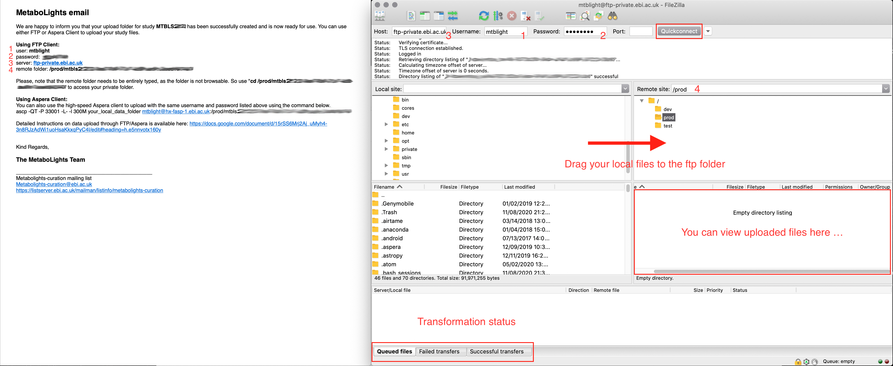

# FAQs
## Upload Download
### *What is the difference between FTP and Aspera?*
FTP, or File Transfer Protocol, is a standard network protocol for exchanging files across the internet. Aspera is a faster alternative to FTP and provides greater user control enabling individual transfer rates and bandwidth sharing to be set.

### *Failed to open TCP connection for SSH error while using Aspera*
This error was due to your firewall settings, which is preventing the Aspera connect plugin from connecting to our servers. Please make sure that your firewall isn’t blocking request to our servers. (Remote host: **hx-fasp-1.ebi.ac.uk / fasp.ebi.ac.uk**, Port: **33001**) and run the diagnosis [Aspera test-connect](https://test-connect.asperasoft.com/).

 If the problem still persists, please contact us at metabolights-help@ebi.ac.uk, along with your Aspera log files.
[Where can I find Aspera log files?](https://www.ibm.com/support/pages/where-are-logs-ibm-aspera-connect-located)

*Typically, consumer and business firewalls allow direct outbound connections from client computers on TCP and UDP. There is no configuration required for Aspera transfers in this case. In the special case of firewalls disallowing direct outbound connections, typically using proxy servers for Web browsing, the following configuration applies:
- Allow outbound connections from the Aspera client on the TCP port (TCP/33001, by default, when connecting to a Windows server, or on another non-default port for other server operating systems).
- Allow outbound connections from the Aspera client on the fasp UDP port (33001, by default).
- If you have a local firewall on your server (like Windows Firewall), verify that it is not blocking your SSH and fasp transfer ports (e.g. TCP/UDP 33001).*

### *How to use FTP uploader (e.g. FileZilla)*

You willl receive a email when you request a upload folder for your study, including:

/// example
```
user: \*\*\*\*
password: \*\*\*\*
server: ftp-private.ebi.ac.uk
remote folder: <your private ftp path>
```
///

Please be aware the remote folder needs to be entirely typed, as the folder is not browsable. So use "cd /prod/<your studyID>-obfuscation\_code" to access your private folder. For example with [FileZilla](https://filezilla-project.org ):



### *Can I upload a compressed file (*.zip)?*
If your data is huge, compression definitely helps especially if you are using FTP. We are okay with both compressed or uncompressed RAW files. If you upload compressed .zip files, please let us know when you have finished uploading all your files. We will then unzip them for you.


### *Error: Insufficient permissions?*
Please contact us at metabolights-help@ebi.ac.uk to resolve this issue.

## Files
### *Error: Insufficient permissions*
Please contact us directly at MetaboLights Help to resolve this issue.

### *Error: No raw or derived files found in the assay*
The online editor by default recognises and lists only the root level files/folders. Please organise your raw files and derived files in the subfolders and specify the full path in the assay sheets.

Example:

FILES/DERIVED\_FILES/subfolder/file.mzml

FILES/RAW\_FILES/subfolder/folder.d


### *Do you accept Excel format?*

We support metabolite identification information reported as tab-separated values (tsv file - [ISA](https://isa-tools.org) ) .

### *How can I move files from one folder to another?*
Please contact us at MetaboLights Help to let us move the files for you. Alternatively, you can delete the files and reupload again in the right folder location.

### *Can I upload self-defined folder to the study?*
You can structure the data in whatever the way you would like to in the study. We recommend you upload RAW files into the RAW\_FILES folder and similarly Derived files into the DERIVED\_FILES folder.

### * How can I recover deleted files？*
Please contact us directly at MetaboLights Help, we will help you to restore the deleted files.

## Sample
### *What is the difference between sample name and source name?*
**Source Name** is a general name that reflects the origin of the samples, e.g urine or serum.

**Sample Name** is the most important element in the ISA-Tab structure that will link everything together. This should be a unique individual name to the sample that has been used throughout the study.

## Assay
### *Error: All Raw and Derived Spectral Data Files are missing from assay.*
Please upload associate raw files and populate the 'RAW Spectral Data File' column with the names of the appropriate .raw file for the sample in your Assays.

### *What is the difference between "Raw Spectral Data File" and "Derived Spectral Data File"?*
"Raw Spectral Data File” are the files directly from the analysis platform.

"Derived Spectral Data File” include opensource converted files (eg. your mzML) or any other derived file you may wish to include.

### *How can replicates be defined in the assay table? *
You could add an additional column to your assays called ‘replicate' which you might prefer to make a clear distinction that it is a replicate.

## MAF

### *How can I add the columns to include the peak area of each metabolite identified per sample?*
Please download the MAF sheet, and edit it locally, e.g. Excel. You can add sample columns to the right end of the sheet and fill in the peak area values to the relevant sample columns in the relevant metabolite rows. Save and then re-upload MAF to your study.

### *Where are the units of the final entries in the maf file defined? *
The MAF table values are generally given as either direct reads from the analysis platform or values normalised to controls. There are no unit fields defined.

### *If we enter several retention times (for different batches which are defined in the sample table), can they all be entered in the retention time column of the maf file separated by slashes?*
You can add these as new rows if you want to specify the RT for each sample or separated with a pipeline “ | “.

