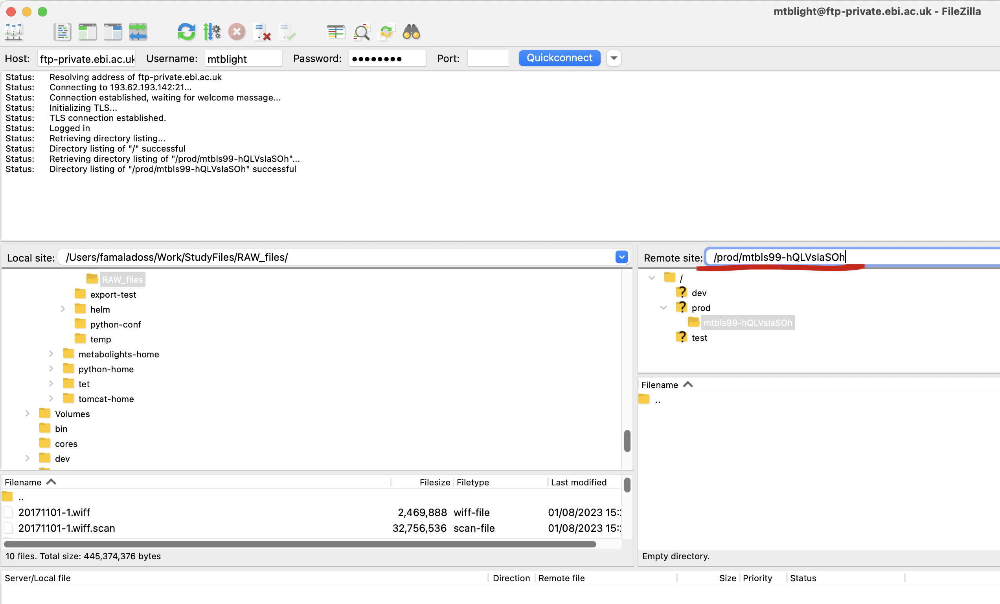
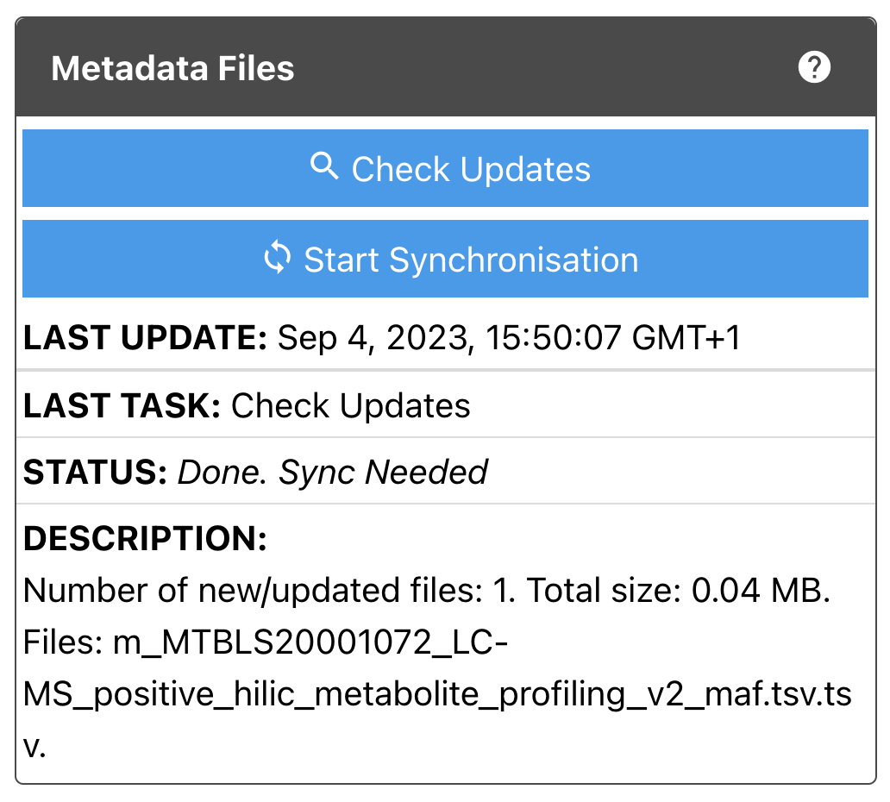
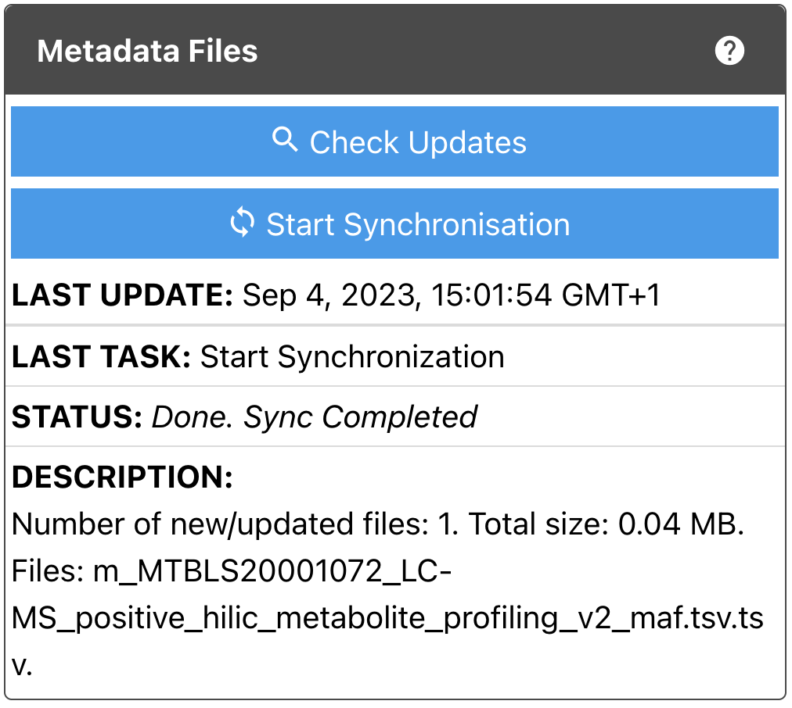
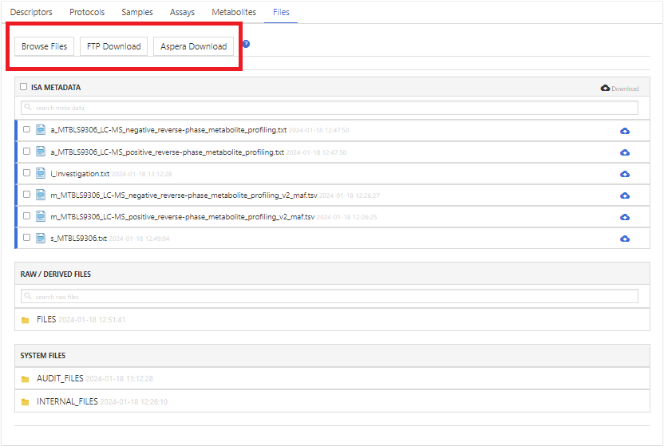
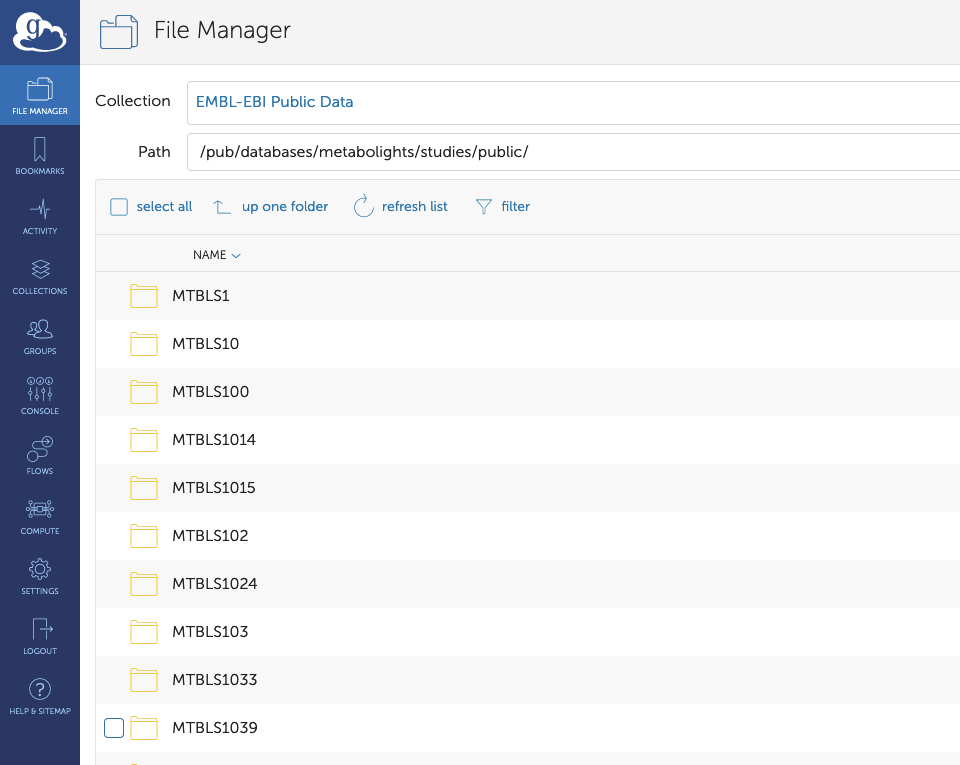

# Files
## Raw data
Raw data, ie. ***spectral files*** produced by the analytical instrument are a requirement for publication of a MetaboLights study, preferably accompanied with an open source version of the files (eg. mzML, nmrML). Where an instrument file is not available it is acceptable to submit the open source file format only.

Each sample should have a corresponding raw data file, both of which should be referenced within the assay table. If providing Raw and Derived files it is recommended to organize files into appropriate folders before uploading (RAW\_FILES and DERIVED\_FILES), and if multiple assay tables are in use, files can be further divided into corresponding assay files.

/// tip 
Raw data will be published on FILES subfolder so RAW file and Derived files path always need to prefixed with 'FILES' on the assay sheets.

///

***Please DO NOT zip files/ folders before upload.***

Eg. File organisation for LC-MS study with positive & negative ionisation mode

**Assay 1 : LC-MS positive mode assay**

| sample Name | ... | MS Assay name | Raw Spectral Data File | ... | Derived Spectral Data File |
| --- | --- | --- | --- | --- | --- |
| Sample1 | ... | Sample1 | FILES/Sample1\_File\_name.raw | ... | FILES/Sample1\_File\_name.mzML |
| Sample1 | ... | Sample1 | FILES/RAW\_FILES/Sample1\_File\_name.raw | ... | FILES/DERIVED\_FILES/Sample1\_File\_name.mzML |
| Sample1 | ... | Sample1 | FILES/RAW\_FILES/LCMS\_pos/Sample1\_File\_name.raw | ... | FILES/DERIVED\_FILES/LCMS\_pos/Sample1\_File\_name.mzML |

**Assay 2 : LC-MS negative mode assay**

| sample Name | ... | MS Assay name | Raw Spectral Data File | ... | Derived Spectral Data File |
| --- | --- | --- | --- | --- | --- |
| Sample1 | ... | Sample1 | FILES/Sample1\_File\_name.raw | ... | FILES/Sample1\_File\_name.mzML |
| Sample1 | ... | Sample1 | FILES/RAW\_FILES/Sample1\_File\_name.raw | ... | FILES/DERIVED\_FILES/Sample1\_File\_name.mzML |
| Sample1 | ... | Sample1 | FILES/RAW\_FILES/LCMS\_neg/Sample1\_File\_name.raw | ... | FILES/DERIVED\_FILES/LCMS\_neg/Sample1\_File\_name.mzML |


### Accepted file formats for raw data
**Raw file formats:** baf, cmp, d, dat, fid, hr, ibd, jpf, lcd, ms, ogd, peg, qgd, raw, ser, wiff + wiff.scan, xp

**Derived file formats:** abf, cdf, cef, cnx, dx, imzml, mgf, msp, mzml, mzxml, nmrml, peakml, smp, xlsx\*, xml, xy

**\*not acceptable alone (must be accompanied with spectrum / chromatogram data)**


## Upload & Synchronisation
A primary requirement for a MetaboLights study is the inclusion of the raw and/or derived data. Files can be uploaded when first creating the study or at any stage prior to submitting a study for curation. The submitted data will be updated to the study in 2 steps.

1. Uploading to FTP folder

2. Synchronising with Study folder

### Uploading to FTP folder
There are 2 ways to upload files to FTP. On the Files tab, click **Upload** and a pop-up box will show both the options.

### 1. Aspera connect plugin (recommended for small set of files)
Aspera is a plugin that is very simple to install in your browser. Select the Aspera Upload option and then Install the plugin. Aspera is a fast way of transferring files which also enables the user to stop the transfer, and later resume where you left off.

If you see raw data files in the final upload with .aspx appended, the file upload may have paused. Please open Aspera connect on your computer to check the status of your upload and resume upload if necessary. If the upload has completed you can delete the .aspx appended files or contact us to do so. (note) You may need to contact your local IT support if you do not have privileges to install browser plugins.
 Once the Aspera plugin is installed, you can upload files by clicking **Aspera Upload** and then **Upload files** from the pop-up window.

### 2. FTP (recommended for large set of files)
FTP can be used on any computer, either directly from the command line or through a graphical user interface. However, on most computers, you have to install an FTP client first. If you are not familiar with using FTP from the command line, we can recommend the free [FileZilla](https://filezilla-project.org ) tool.

You should have received two emails after study creation. One email provides the details about the FTP server and credentials. You can also get these details from the pop-up window by clicking **Files** tab -> **Upload** -> **Private FTP Upload**.


/// example | 

Your details will be something like below.

```bash
user: \*\*\*\*
password: \*\*\*\*
server: ftp-private.ebi.ac.uk
remote folder: /prod/<private ftp folder name>
```

///

After installation of **FileZilla**, open and enter the FTP connection details. You need to enter Host, Username and Password to connect to the FTP server. Once connected **you will not be** able to browse the folder, you need to copy paste the remote folder path in Remote site text box and press enter, then your FTP folder will be browsable on the right side.

{width=600}

Once the upload folder is opened and browsable, you will be able to drag & drop files from your local system (left side) to the FTP folder (right side).

### Synchronising with Study folder
After successfully uploading files (Aspera or FTP), they still need to be synced to the study folder (the directory that is eventually made public). This is done through the Files tab in the MetaboLights Editor.

When you scroll down, you will see two boxes like below.


Files on MetaboLights are stored as two types - Metadata files or Data files. Metadata files are ISA tabular files such as i\_Investigation.txt, s\_MTBLSxxx.txt, a\_MTBLSxxx.txt and m\_MTBLSxxx\_maf.tsv. Data files are RAW\_FILES and/or DERIVED\_FILES produced from the analytical instrument. There are two boxes to allow the submitter to synchronise metadata and data separately. You can also check the last status. As you can see in the box there are two blue tabs - **Check Updates** & **Start Synchronisation**.


### Check Updates
After clicking **Check Updates**, you will see the comparison between the FTP (upload) folder and study folder. This will give the details of the latest files that were uploaded which need to be synced with the study folder.

{width=400}


### Start Synchronisation
After clicking **Start Synchronisation**, files will be synced to the study folder. It may take seconds, minutes or longer to complete. It will depend on the number and size of files. Once synchronisation is done, the status will change like below. Files will show in the MetaboLights Editor after clicking the **Refresh **button.****

{width=400}

## Download

### 1. Download from the online editor
On the Files tab, click blue cloud icons to download individual files or grey cloud icon to download multiple files.

### 2. FTP and Aspera download
On the Files tab, click **Browse Files** to open a new tab to show study files content from FTP public. If you click **FTP Download**, that will open Explorer with study files FTP public path (Assuming you are using a Mac). If you click **Aspera Download**, study files can be downloaded using Aspera tool - **Download files** button (Assuming you have installed Aspera plugin on your browser).



All public studies can be downloaded from our public FTP site. Server : ftp.ebi.ac.uk ; directory path : /pub/databases/metabolights/studies/public/ (You would need a FTP client software like **Filezilla** to access and download).Each public study can be found in the corresponding **MTBLS-id** folder.


### 3. API download
You can view/download files by using our web service: typing ```https://www.ebi.ac.uk/metabolights/ws/studies/<studyid\>/<filename>``` to your browser address bar.


### 4. Globus
[Globus](https://www.globus.org/) provides a more user-friendly, feature-rich directory interface for interacting with the FTP server.The public study Files can be downloaded through [our Globus Endpoint](https://app.globus.org/file-manager?origin_id=47772002-3e5b-4fd3-b97c-18cee38d6df2&origin_path=%2Fpub%2Fdatabases%2Fmetabolights%2Fstudies%2Fpublic%2F&two_pane=false) **'EMBL-EBI Public Data'** and the subfolders of the path ‘/pub/databases/metabolights/studies/public/’



