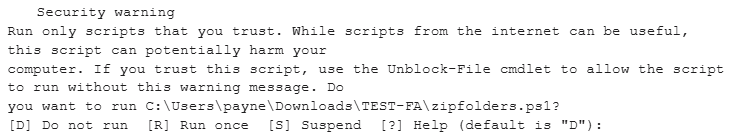
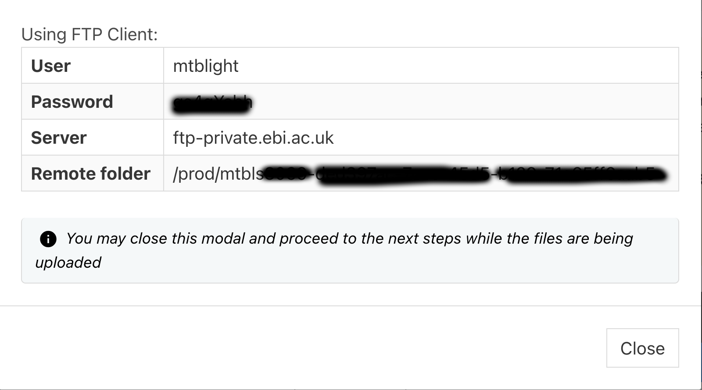
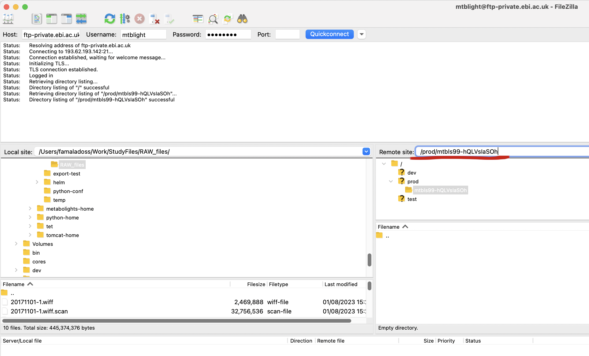
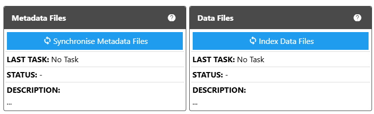
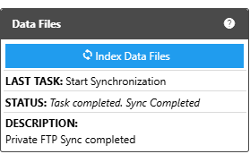
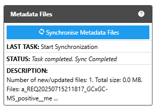
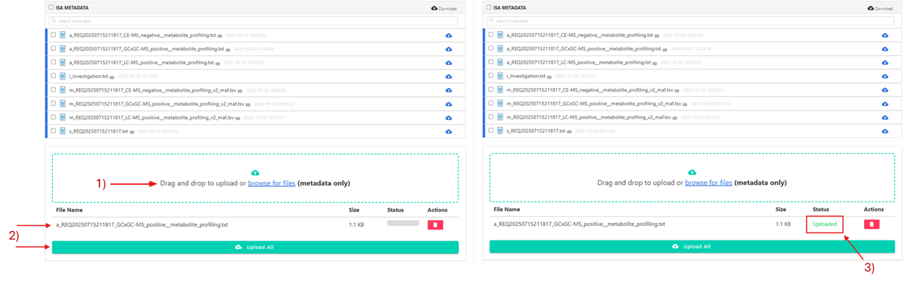
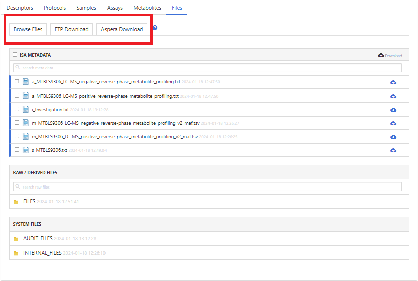
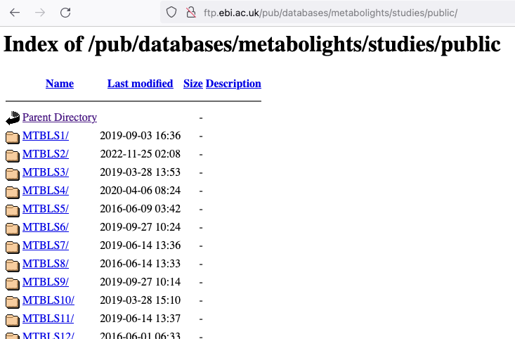
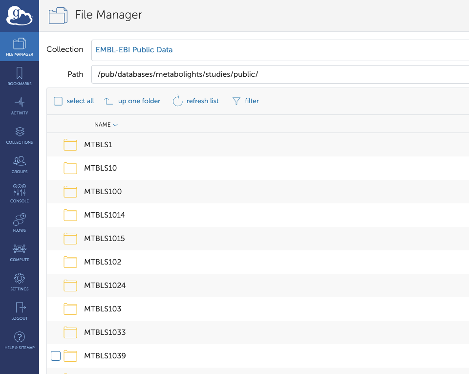

# Files
## Raw data
Raw data, ie. ***spectral files*** produced by the analytical instrument are a requirement for publication of a MetaboLights study, preferably accompanied with an open source version of the files ('Derived files', e.g., mzML, nmrML). Where an instrument file is not available it is acceptable to submit the open source file format only.

### Accepted file formats for raw data
**Raw file formats:**  baf, cmp, d, dat, fid, hr, ibd, jpf, lcd, ms, peg, qgd, raw, ser, wiff + wiff.scan, smp

**Derived file formats:** cdf, cef^, cnx^, dx^, imzml, mgf\^, msp^, mzml, mzxml, nmrml, peakml^, xlsx\^, xy^

**\^ not acceptable alone (must be accompanied with spectrum / chromatogram data)**

Each sample should have a corresponding raw data file, both of which should be referenced within the assay table. If providing Raw and Derived files it is recommended to organize files into appropriate folders before uploading (RAW\_FILES and DERIVED\_FILES), and if multiple assay tables are in use, files can be further divided into corresponding assay files.

/// tip 
Raw data will be published on FILES subfolder so RAW file and Derived files path always need to prefixed with 'FILES' on the assay sheets.


Eg. File organisation for LC-MS study with positive & negative ionisation mode

**Assay 1 : LC-MS positive mode assay**

| sample Name | ... | MS Assay name | Raw Spectral Data File | ... | Derived Spectral Data File |
| --- | --- | --- | --- | --- | --- |
| Sample1 | ... | Sample1 | FILES/Sample1\_File\_name.raw | ... | FILES/Sample1\_File\_name.mzML |
| Sample1 | ... | Sample1 | FILES/RAW\_FILES/Sample1\_File\_name.raw | ... | FILES/DERIVED\_FILES/Sample1\_File\_name.mzML |
| Sample1 | ... | Sample1 | FILES/RAW\_FILES/LCMS\_pos/Sample1\_File\_name.raw | ... | FILES/DERIVED\_FILES/LCMS\_pos/Sample1\_File\_name.mzML |

**Assay 2 : LC-MS negative mode assay**

| sample Name | ... | MS Assay name | Raw Spectral Data File | ... | Derived Spectral Data File |
| --- | --- | --- | --- | --- | --- |
| Sample1 | ... | Sample1 | FILES/Sample1\_File\_name.raw | ... | FILES/Sample1\_File\_name.mzML |
| Sample1 | ... | Sample1 | FILES/RAW\_FILES/Sample1\_File\_name.raw | ... | FILES/DERIVED\_FILES/Sample1\_File\_name.mzML |
| Sample1 | ... | Sample1 | FILES/RAW\_FILES/LCMS\_neg/Sample1\_File\_name.raw | ... | FILES/DERIVED\_FILES/LCMS\_neg/Sample1\_File\_name.mzML |

///

/// warning | If you have raw data folders (d, .raw, or any NMR raw data folder), compress them individually.

**Starting on 12th June 2025, MetaboLights will accept only raw/derived data files and compressed versions of raw/derived data folders (e.g., .d, .raw, or any NMR raw data folder)**. If your study includes raw data folders, please compress each folder **individually** using a ZIP utility before submission.  **A zip file containing multiple raw folders is not accepted.**

///

## Zipping raw data files folders
If you have uploaded raw data files as .d / .D or .raw / .RAW folders, MetaboLights won’t pass the validation. These raw data folders need to be zipped and referenced in Assays as myfilename1.raw.zip or myfilename2.d.zip. Below instructions will help you to zip your raw data folders locally on your computer before uploading to FTP and MetaboLights (e.g., with a client such as FileZilla).

**Mac OS**

1. Download the script  zipfolder.sh by Right click & Save this link [zipfolder.sh](https://raw.githubusercontent.com/EBI-Metabolights/mtbls-validation/main/docs/scripts/zipfolders.sh) on your computer. 
Assuming your raw data folders are arranged in a folder called ‘RAW_FILES’. 
2. Copy zipfolder.sh to the newly created ‘RAW_FILES’ folder. Change permission of the script to executable. Execute the below command under the ‘RAW_FILES’ folder.
   
         chmod 755 zipfolders.sh

3. Run the following command to start zipping as a background process. 

         nohup ./zipfolders.sh > zip.out &

Zipping script runs in the background. You can verify the log file zip.out if it is appending the logs. You will start to see zip files. Once all the folders are zipped. zip.out log file stops to append content. All zipped files will be moved into a folder called Zipped.

4. Verify all the folders are zipped. Execute the following commands to check folders count and zip count are matching. If matching, upload only zip files found under the Zipped folder to MetaboLights.

         find * -name "*.raw" -maxdepth 0 -type d | wc -l   # check number of .raw folders

         find * -name “*.RAW” -maxdepth 0 -type d | wc -l   # check number of .RAW folders

         find * -name “*.d” -maxdepth 0 -type d | wc -l   # check number of .d folders

         find * -name “*.D” -maxdepth 0 -type d | wc -l   # check number of .D folders

 Execute below command under Zipped folder

         find * -name "*.zip" -maxdepth 0 -type f  | wc -l   # check number of zip files


**Windows**

1. Download the script zipfolders.ps1 by Right click & Save this link [zipfolders.ps1](https://raw.githubusercontent.com/EBI-Metabolights/mtbls-validation/main/docs/scripts/zipfolders.ps1) on your computer. Assuming your raw data folders are arranged in a folder called ‘RAW_FILES’. You have N number of raw data folders on this folder.
2. Copy zipfolders.ps1 to ‘RAW_FILES’ folder. 
3. Run the script zipfolders.ps1

   
    Command Prompt or PowerShell
   
If RAW_FILES folder full path is C:/User/RAW_FILES, then Run command will be 

     *C:/User/RAW_FILES/RAW_FILES/zipfolders.ps1*

Type the full path of the script and press enter. If you get script execution permission error, execute the following command. Then execute the run command again.

	 *Set-ExecutionPolicy -ExecutionPolicy Unrestricted -Scope CurrentUser*

 On executing the script, the following security warning may appear:

{width=700 height=700}
     
Please give R as input and press enter.

4. Verify all the folders are zipped and moved into a folder called **Zipped**. Check folders count and zip count are matching. If matching, upload only zip files found under the **Zipped** folder  to MetaboLights.


## Upload & Synchronisation

A primary requirement for a MetaboLights study is the inclusion of the raw and/or derived data. Files can be uploaded when first creating the study or at any stage prior to submitting a study for curation. The submitted data will be updated to the study in 2 steps.

1. Uploading to FTP folder

2. Indexing FTP folder content

### Uploading to FTP folder

There are 2 ways to upload files to FTP. On the Files tab, click **Upload** and a pop-up box will show both the options.

### 1. Aspera connect plugin (recommended for small set of files)

Aspera is a plugin that is very simple to install in your browser. Select the Aspera Upload option and then Install the plugin. Aspera is a fast way of transferring files which also enables the user to stop the transfer, and later resume where you left off.

Install the plugin by searching **IBM aspera connect** extention in the Chrome Web Store if your browser is Chrome. If your browser is Firefox, you have to search for and install **IBM Aspera Connect** add-on.Then you will be able to upload files by clicking the Upload Files button.
This page provides detailed information about how to install and transfer files using Aspera in different ways. [https://embl.service-now.com/kb?id=kb_article_view&sysparm_article=KB0011565](https://embl.service-now.com/kb?id=kb_article_view&sysparm_article=KB0011565)

If you see raw data files in the final upload with .aspx appended, the file upload may have paused. Please open Aspera connect on your computer to check the status of your upload and resume upload if necessary. If the upload has completed you can delete the .aspx appended files or contact us to do so. (note) You may need to contact your local IT support if you do not have privileges to install browser plugins.
 Once the Aspera plugin is installed, you can upload files by clicking **Aspera Upload** and then **Upload files** from the pop-up window.

### 2. FTP (recommended for large set of files)

FTP can be used on any computer, either directly from the command line or through a graphical user interface. However, on most computers, you have to install an FTP client first. If you are not familiar with using FTP from the command line, we can recommend the free [FileZilla](https://filezilla-project.org ) tool.

You should have received two emails after study creation. One email provides the details about the FTP server and credentials. You can also get these details from the pop-up window by clicking **Files** tab -> **Upload** -> **Private FTP Upload**.



/// example | 

Your details will be something like below.

```bash

Server (Host): ftp-private.ebi.ac.uk
Username: \*\*\*\*
Password: \*\*\*\*
Remote folder (Remote site): /prod/<private ftp folder name>
```

///

After installation of **FileZilla**, open and enter the FTP connection details. You need to enter Host, Username and Password to connect to the FTP server. Once connected **you will not be** able to browse the folder, you need to copy paste the remote folder path in Remote site text box and press enter, then your FTP folder will be browsable on the right side.

{width=600}

Once the upload folder is opened and browsable, you will be able to drag & drop files from your local system (left side) to the FTP folder (right side).

### Indexing FTP folder content

After successfully uploading files (Aspera or FTP), they still need to be indexed (the directory that is eventually made public). This is done through the Files tab in the MetaboLights Editor.

When you scroll down, you will see two boxes like below.




Files on MetaboLights are stored as two types - Data files or Metadata files. Data files are RAW\_FILES and/or DERIVED\_FILES produced from the analytical instrument. Metadata files are ISA tabular files such as i\_Investigation.txt, s\_MTBLSxxx.txt, a\_MTBLSxxx.txt and m\_MTBLSxxx\_maf.tsv. 

There are two boxes to allow the submitter to index data files and synchronise metadata files separately. 


### Index Data Files

After clicking **Index Data Files**, raw and derived data files will be synced to the study folder. It may take seconds, minutes or longer to complete. It will depend on the number and size of files. Once indexing is done, the status will change like below. Files will show in the MetaboLights Editor automatically.

{width=300}


### Start Metadata Synchronisation

After clicking **Start Synchronisation**, files will be synced to the study folder. It may take seconds, minutes or longer to complete. It will depend on the number and size of files. Once synchronisation is done, the status will change like below. Files will show in the MetaboLights Editor automatically.

{width=300}

### Alternative for Metadata File Upload and Synchronization: **NEW Drag and Drop feature**

The **Drag and Drop feature** provides a simple and efficient way for submitters to upload and synchronize **Metadata files** (i_Investigation.txt, s_MTBLSxxx.txt, a_MTBLSxxx.txt, and m_MTBLSxxx_maf.tsv).

To use it, simply drag and drop the updated metadata files into the **Drag and Drop** area, or click **browse for files** to select them manually.

The selected files will be listed below the upload box. Once ready, click **Update All** — the metadata files will then be marked as **Uploaded**.


{width=400}


## Download

### 1. Download metadata files from the online editor

On the Files tab, click blue cloud icons to download individual files or grey cloud icon to download multiple files.

### 1. Download metadata files using MetaboLights API

You can view/download metadata files by using our web service: typing ```https://www.ebi.ac.uk/metabolights/ws/studies/<studyid\>/<filename>``` to your browser address bar.


### 3. Download with FTP and Aspera clients

On the Files tab, click **Browse Files** to open a new tab to show study files content from FTP public. If you click **FTP Download**, that will open Explorer with study files FTP public path (Assuming you are using a Mac). If you click **Aspera Download**, study files can be downloaded using Aspera tool - **Download files** button (Assuming you have installed Aspera plugin on your browser).




/// Note

All public studies can be downloaded from our public FTP site. 

- **FTP server** ftp.ebi.ac.uk
- **Directory**: /pub/databases/metabolights/studies/public/ 

You would need a FTP client software like **Filezilla** to access and download. Each public study can be found in the corresponding **MTBLS-id** folder.

///



### 4. Download with Globus

[Globus](https://www.globus.org/) provides a more user-friendly, feature-rich directory interface for interacting with the FTP server.The public study Files can be downloaded through [our Globus Endpoint](https://app.globus.org/file-manager?origin_id=47772002-3e5b-4fd3-b97c-18cee38d6df2&origin_path=%2Fpub%2Fdatabases%2Fmetabolights%2Fstudies%2Fpublic%2F&two_pane=false) **'EMBL-EBI Public Data'** and the subfolders of the path ‘/pub/databases/metabolights/studies/public/’




/// note

 You can download metadata files using MetaboLights Editor or API. If you want to download data files, you MUST use FTP, Aspera or Globus clients.
///
