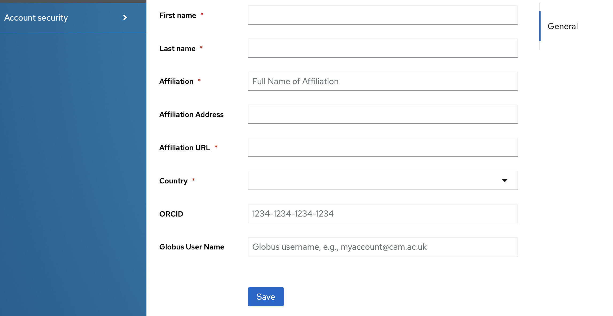
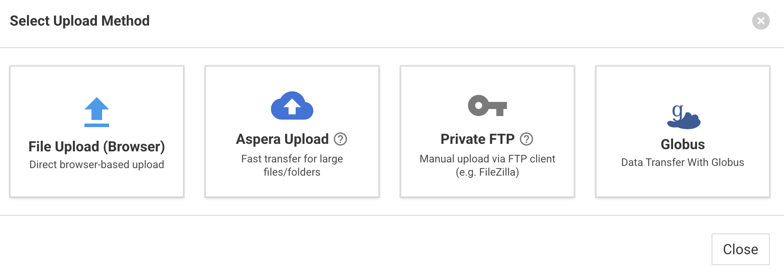
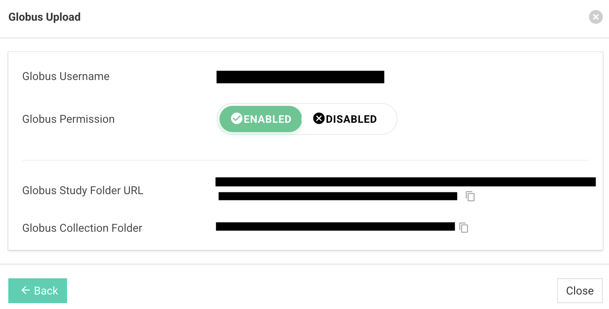
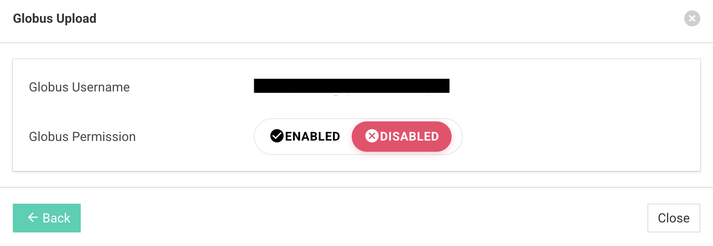

# MetaboLights Globus Integration Guide

!!! note
    This guide covers everything you need to know about setting up, integrating, and using Globus for uploading and downloading study files in the MetaboLights editor ecosystem.

## What is Globus?

**Globus** is a fast, reliable, and secure file transfer service designed for the global research community. It resolves the challenges of transferring large datasets by managing background transfers, automatically recovering from network issues, and providing an intuitive web-based file manager. 

In MetaboLights, Globus is primarily used to securely upload massive raw data files and download public study collections seamlessly.

---

## How to Create a Globus Account

If you do not already have a Globus identity, you can quickly create one using your institutional credentials, ORCID, Google, or by creating a dedicated Globus ID.

1. Navigate to the **[Globus Sign-in Page](https://app.globus.org/)**.
2. Select your Organization from the provided dropdown (e.g., your University or Institute) to use Single Sign-On (SSO).
3. If your institution is not listed, you can link your **ORCID**, **Google Account**, or sign up for a **Globus ID** at the bottom of the page.
4. Follow the on-screen prompts to finish establishing your Globus account.

---

## Integrating Globus with the MetaboLights Editor

To use Globus to transfer private study files, you must first tell MetaboLights who your Globus user is.

1. Log into your **MetaboLights Editor Web Application**.
2. Navigate to your **Account Profile** page from the top-right navigation menu.
3. Locate the **Globus Username** field.
4. Enter your exact Globus ID/Username (e.g., `user@institution.edu` or `johndoe@globusid.org`).
5. Save your profile. _(Without this step, MetaboLights cannot grant Globus permissions to your study!)_

!!! important
    Ensure your username is spelled correctly. If you do not provide a Globus username in your profile, the Globus upload functionality will remain locked and display a warning.

---

## Enabling and Disabling Globus Permissions for a Study

Because your study folders are private until publication, you have strict control over who can access your Globus endpoints.

1. Open your private study in the MetaboLights editor and navigate to the **Files** section.
2. Select **Upload Files** or access the **Globus Upload** tab.

3. Locate the **Globus Permission** toggle group.
    - **To Enable:** Click the green **Enabled** button. MetaboLights will automatically reach out to Globus to provision an access rule ensuring only your linked Globus username has access to your study folder.

    - **To Disable:** Click the red **Disabled** button. This immediately revokes your Globus access role from the study folder endpoint, ensuring files are secured.

!!! tip
    Always *Disable* your permissions after your file transfers have successfully completed. Keeping permissions scaled down ensures max security for pre-published data.

---

## Using Globus to Upload and Download Files

Once your Globus permission is **Enabled**, you are ready to manage your files via the Globus network!

### Uploading Files (Private Studies)
1. Ensure your Globus permission toggle is set to **Enabled**.
2. Once enabled, the UI will reveal two critical details:
    - **Globus Study Folder URL:** A direct link to access your private study folder in the Globus File Manager.
    - **Globus Collection Folder Path:** The exact path of your study.
    - Use the convenient **Copy Icons** next to the URL or Path to copy the strings to your clipboard.
3. **Click the Globus Study Folder URL**. This opens the Globus File Manager in a new browser tab.
4. In the Globus File Manager:
    - Your MetaboLights study endpoint will appear on one end of the transfer interface.
    - Select your personal machine (via **Globus Connect Personal**) or your institutional high-performance cluster on the other end.
5. Highlight the raw files or folders you wish to upload, and click **Start Transfer**! Globus will handle the rest.

### Downloading Files (Public Studies)
1. If you are exploring a **public** MetaboLights study, navigate to its files page.
2. Click the **Globus Download** button that is available in the public download interface.
3. This will launch a modal explaining the Globus File Manager tool. Click the primary **Globus Download** button found there.
4. You will be prompted to open the Globus File Manager web interface seamlessly linked to the MetaboLights public dataset endpoint.
5. Log into Globus (if not already authenticated) and select your target destination to begin pulling down the public datasets securely and quickly.

---

!!! caution
    If you intend to upload files directly from your personal laptop or desktop via Globus, you will need to install **Globus Connect Personal**. This turns your local computer into an endpoint that the Globus web app can communicate with. Visit [globus.org/globus-connect-personal](https://www.globus.org/globus-connect-personal) to install it for Mac, Windows, or Linux.
