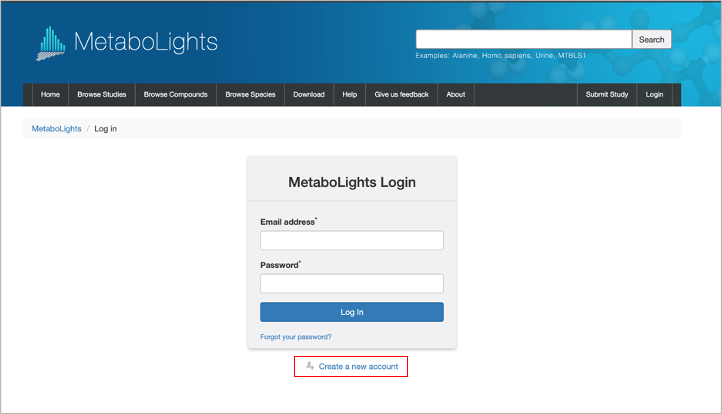
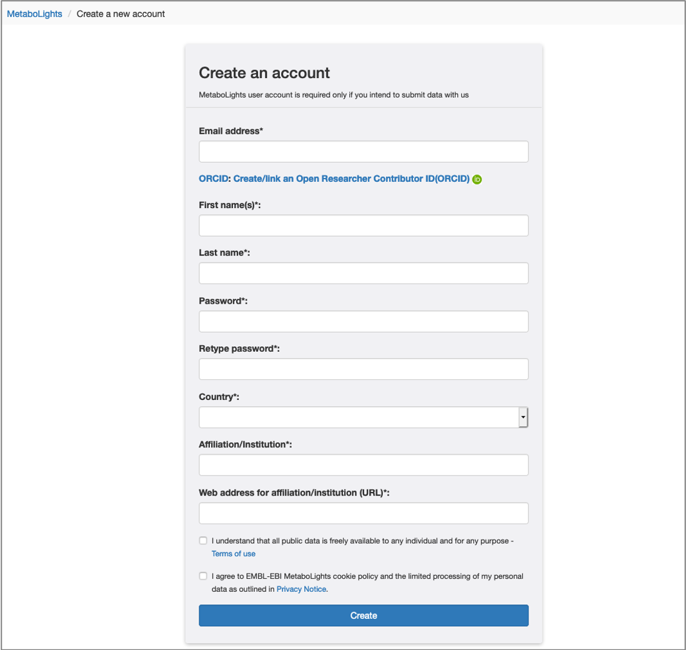
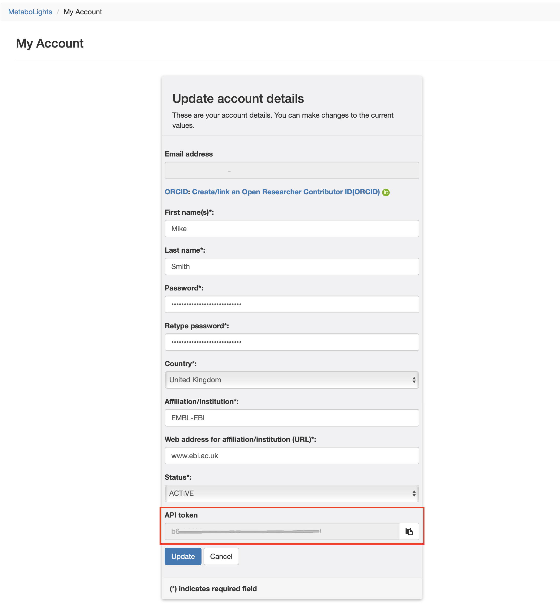
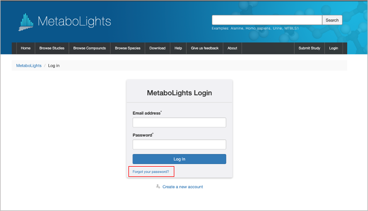
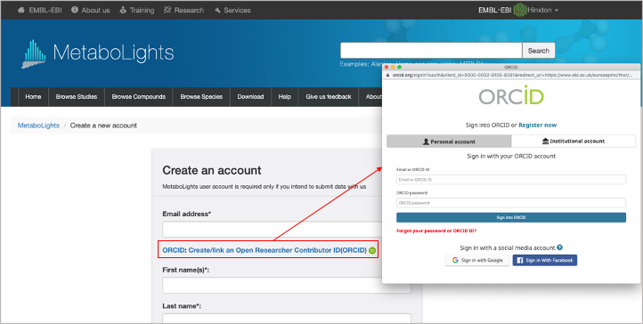
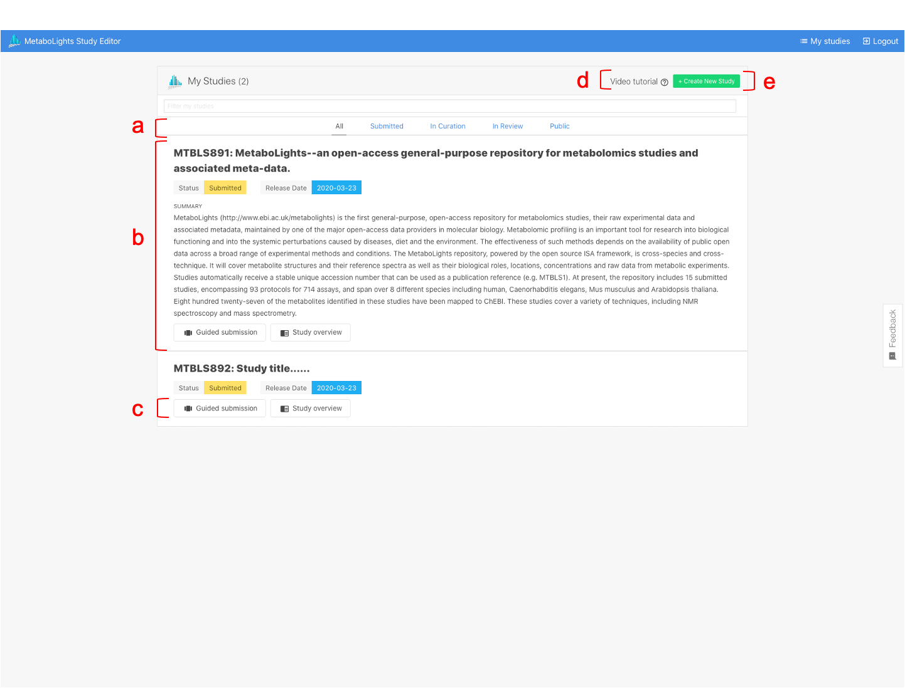

# MetaboLights Account
## Create account
You can create an account by selecting Login above and [Create a new account](https://www.ebi.ac.uk/metabolights/newAccount).

{width=600}

When creating your MetaboLights account your email address will be your user name.

{width=600}

  *If you have problems accessing your account for the first time, please check your email (junk folder also!) for a confirmation.Alternatively, contact us MetaboLights Help*.

## Personal API token
If you want to use the MetaboLights web service, you could find your personal API token from [my account](https://www.ebi.ac.uk/metabolights/myAccount%20).

{width=600}

## Update login details
Your email address will be your user name. Please contact us directly at MetaboLights Help if you need to update this at any time. To rest a password simply click the [forgot your password](https://www.ebi.ac.uk/metabolights/forgotPassword) link on the login page.

{width=600}

## ORCID
You can link MetaboLights account to your ORCID account, allowing you to claim your data submissions as part of your research achievements. [What is ORCID?](https://orcid.org/about)

{width=600}

## My studies
Your [My Studies](https://www.ebi.ac.uk/metabolights/editor/console) page provides an overview of all studies you have created in MetaboLights.

{width=600}

* (a) Select to view all studies or studies with a particular status
* (b) View basic outline information for each study including accession number, title, status, release date
* (c) Choose to edit a study using Guided submission or Online editor tools
* (d) View the submission tutorial video
* (e) Create a new study
