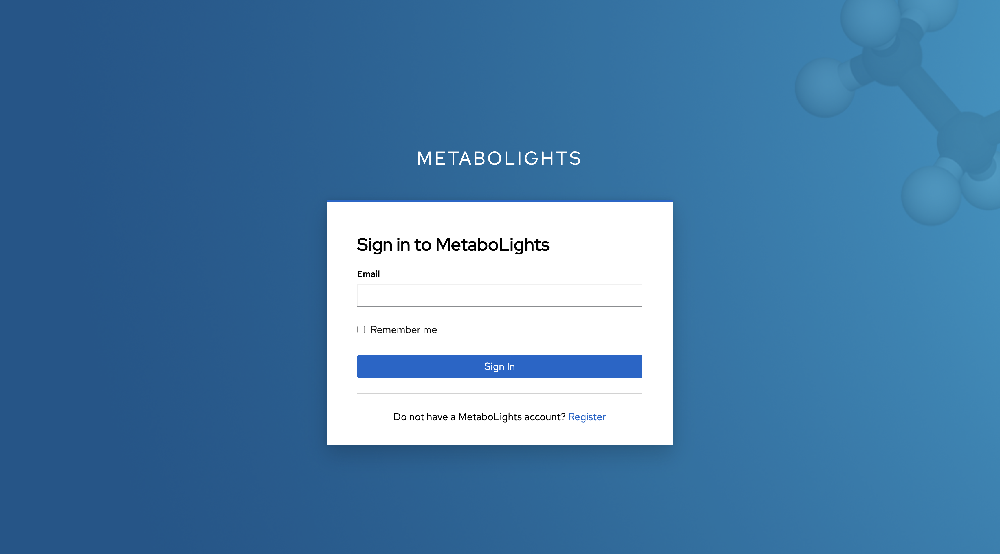
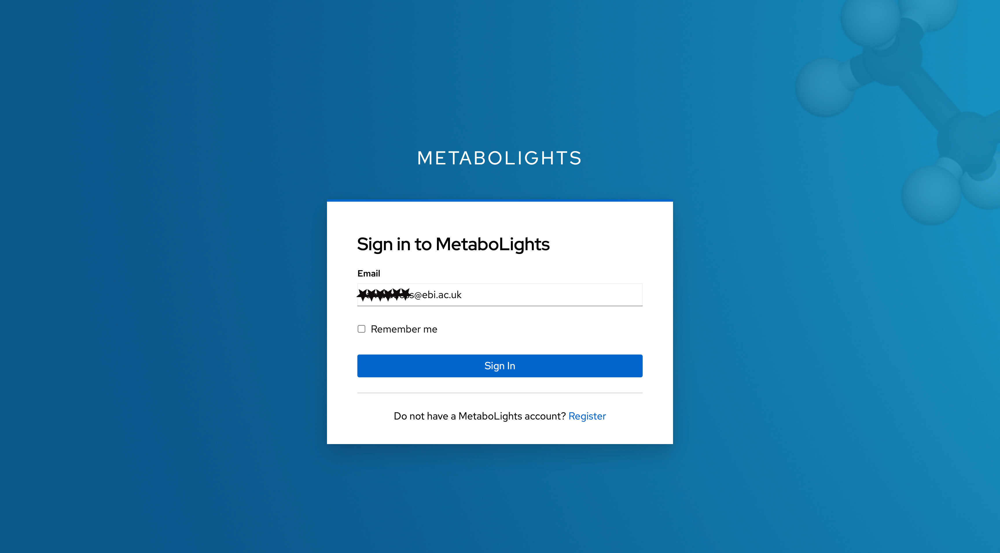
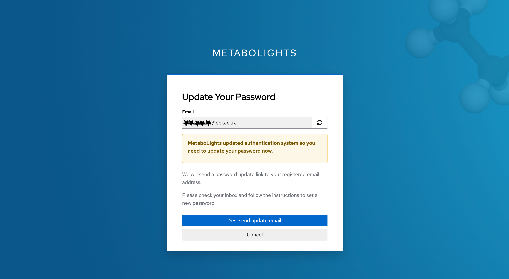
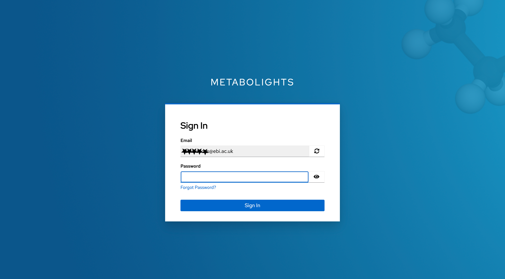
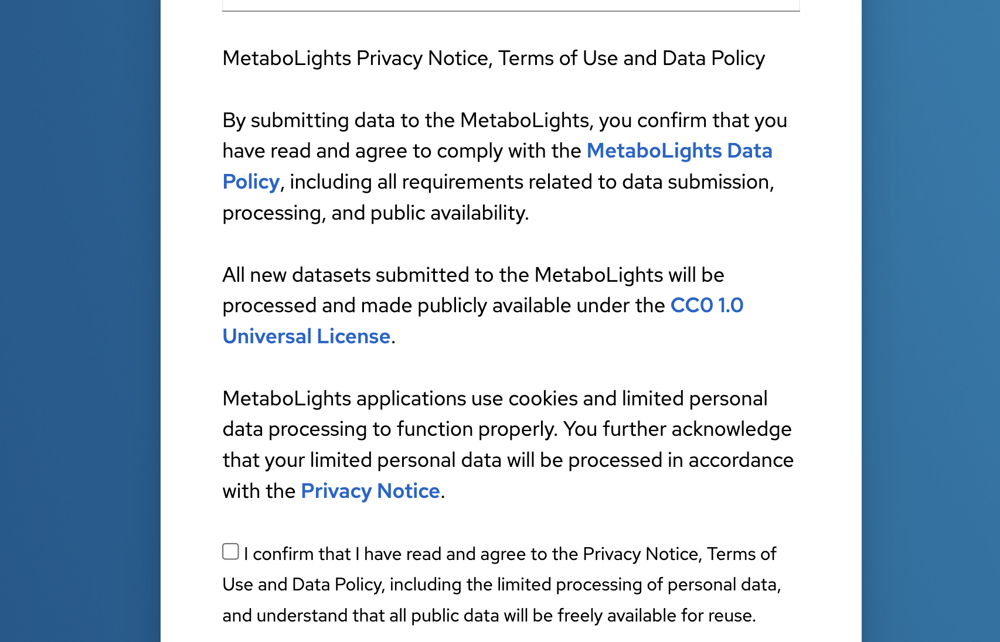
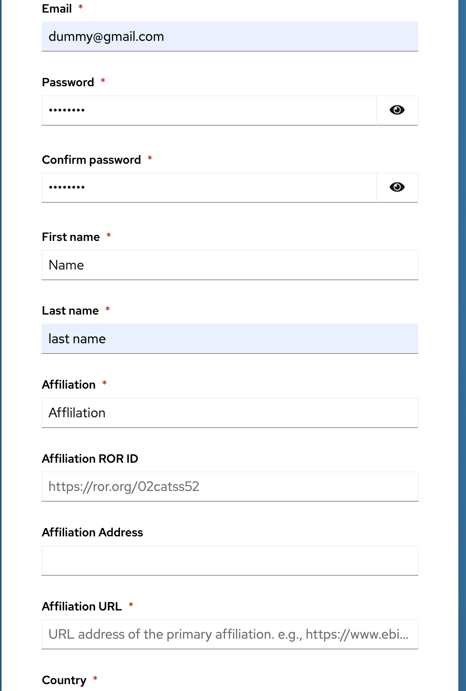
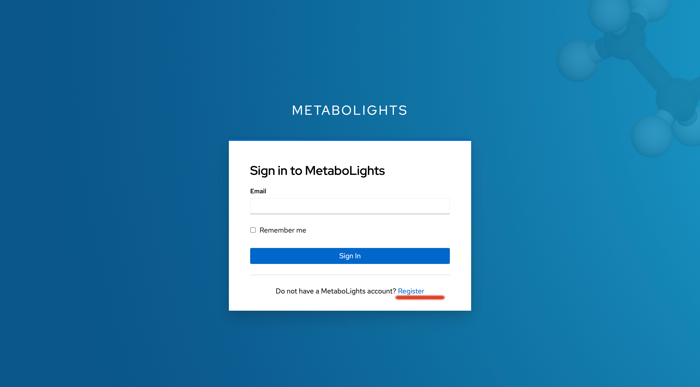
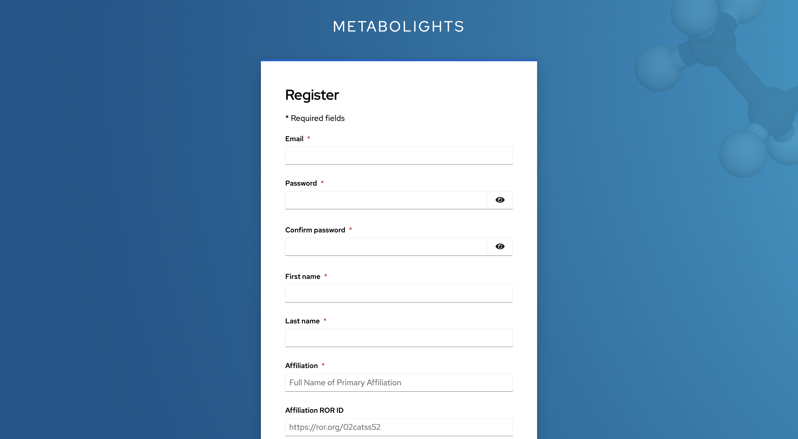
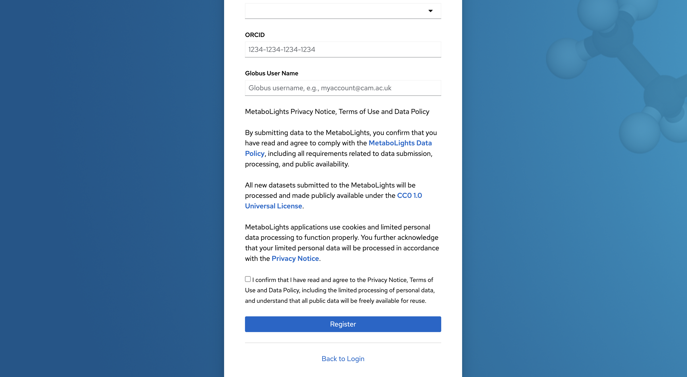
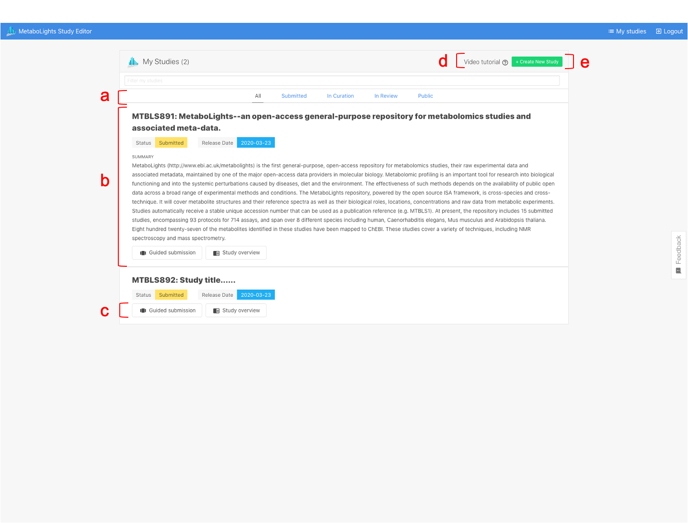

# MetaboLights Account
## Migration

We are migrating all our users to a new authentication management system. During migration time, new user registration won't be available until we migrate all users to the new system. 

---
## User Login and Registration

- As part of the migration to the new authentication system, the user authentication flow for existing users has been updated. Please follow the steps below to understand and navigate the revised authentication steps.

---
## Existing User Login

Existing users logging in for the first time after migration should follow these steps:

1. Go to the editor portal login [page](https://www.ebi.ac.uk/metabolights/editor/login). Users will be prompted to enter their account email.
{width=900}

2. Enter your email address.The system checks whether the email is valid and available in the system.
{width=900}

3. If the email is valid, user will be asked to send password restet link to the email. Once user clicks yes,  a password reset email is sent to the user's inbox.
{width=900}

4. Open the email and click the password reset link.

5. Set a new password. Return to the website.

6. Enter the same email address again. On the next page, enter the new password you just created.
{width=900}

7. After successful login, review and accept: Data Policy Agreement & Revised Privacy Notice Agreement.
{width=900}

8. If needed, update your profile information.

{width=600}

After completing these steps, you will be redirected to the editor portal.

---

## New User Registration

New users who do not yet have an account should follow these steps:

1. Go to the editor portal login [page](https://www.ebi.ac.uk/metabolights/editor/login). .

2. Click the **Register** button.
{width=900}
3. The registration form will open.
{width=900}

4. Fill in the required registration details.

5. At the bottom of the form, accept: Data Policy Agreement & Privacy Notice Agreement.  
{width=900}
6. Submit the form to create your account.

7. A verification email will be sent to your registered email address.

8. Open the email and verify your email address.

9. Return to the site and go to the login page.
{width=900}

10. Enter your email address on the first page.
{width=900}

11. On the next page, enter the password you created during registration.
{width=900}

12. After successful login, you will be taken to the editor portal.

---
## Important Notes

- Existing users must reset their password the first time they log in after migration.  
- New users must verify their email before they can log in.  
- Acceptance of the Data Policy Agreement and Privacy Notice Agreement is required before accessing the editor portal.  
- Profile updates are optional for existing users unless changes are needed.

## My studies
Your [My Studies](https://www.ebi.ac.uk/metabolights/editor/console) page provides an overview of all studies you have created in MetaboLights.

{width=900}

* (a) Select to view all studies or studies with a particular status
* (b) View basic outline information for each study including accession number, title, status, release date
* (c) Choose to edit a study using Guided submission or Online editor tools
* (d) View the submission tutorial video
* (e) Create a new study