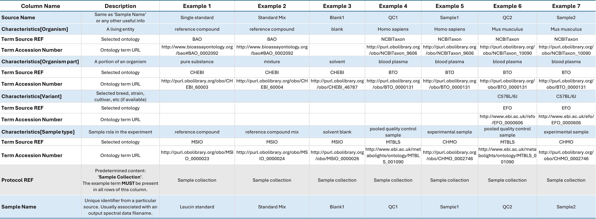
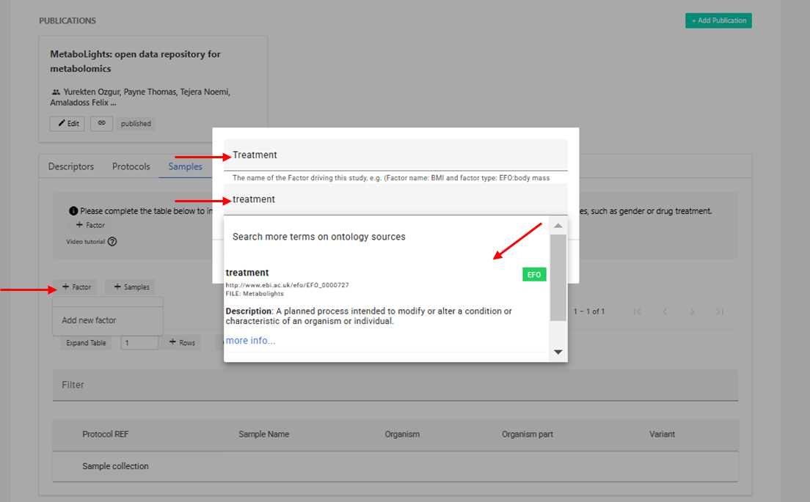
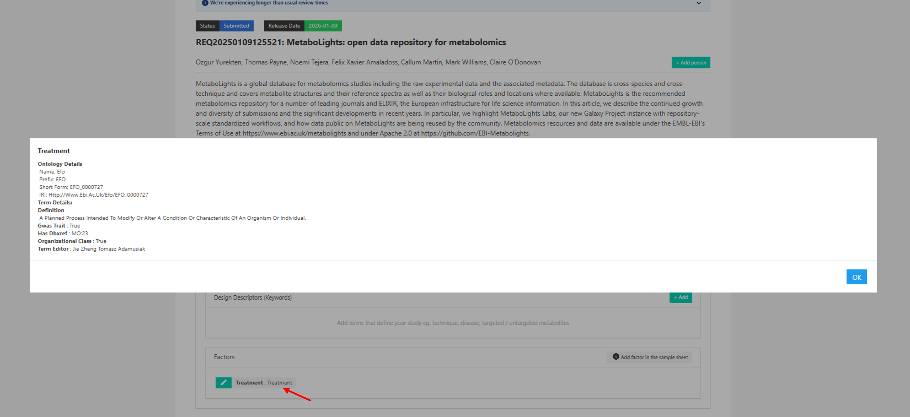

# Sample
## Sample
The sample information should provide all relevant facts about each sample and any controls/standards included in the study. There is ONE sample sheet per study.

Sample metadata should include a unique sample name, organism, organism part (for controls use eg. experimental blank and solvent) and sample type (ie. control, QC, experimental sample). Further sample descriptors should be included where available by selecting +Factor to add new columns (eg. Gender, Age, Treatment).

A group of samples can be added to the sample table using **+Samples** and pasting a list or selecting to import Raw data file names if appropriate. There is also the option to add as many new rows as required with **+Rows** and edit cells individually.

    {width=900 height=1200}

### Delete selected samples from sample sheet

To delete a sample in the online editor, click the first cell on the left of the sample row to highlight it. Then, select the Delete button that appears next to the Download and View file options.

A second option to delete samples is to download the Sample Sheet, open with eg. Excel, delete selected rows, save file without changing file name or extension, re-upload it to the study and synchronize Metadata files. 

Example of required information for different Sample types

| Column Name | Description | Example 1 | Example 2 | Example 3| Example 4 | Example 5 | Example 6 | Example 7 |
| --- | --- | --- | --- | --- | --- | --- | --- | --- |
| Source Name | Unique source identifier of the Sample or simply repeat 'Sample Name’ | Single standard | Standard mix | Blank1 | QC1 | Sample1 | QC2 | Sample2 |
| **Characteristics[Organism]** | A living entity | reference compound | reference compound | blank | Homo sapiens | Homo sapiens | Mus musculus | Mus musculus |
| **Term Source REF** | Selected ontology | BAO | BAO | | NCBITaxon | NCBITaxon | NCBITaxon | NCBITaxon |
| **Term Accession Number** | Ontology term URL | http://www.bioassayontology.org/bao#BAO_0002092 | http://www.bioassayontology.org/bao#BAO_0002092 | | http://purl.obolibrary.org/obo/NCBITaxon_9606 | http://purl.obolibrary.org/obo/NCBITaxon_9606 | http://purl.obolibrary.org/obo/NCBITaxon_10090 | http://purl.obolibrary.org/obo/NCBITaxon_10090 |
| **Characteristics[Organism Part]**| A portion of an organism | pure substance | mixture | solvent | blood plasma | blood plasma | blood plasma | blood plasma |
| **Term Source REF** | Selected ontology | CHEBI | CHEBI | CHEBI | BTO | BTO | BTO | BTO |
| **Term Accession Number** | Ontology term URL | http://purl.obolibrary.org/obo/CHEBI_60003 | http://purl.obolibrary.org/obo/CHEBI_60004 | http://purl.obolibrary.org/obo/CHEBI_46787 | http://purl.obolibrary.org/obo/BTO_0000131 | http://purl.obolibrary.org/obo/BTO_0000131 | http://purl.obolibrary.org/obo/BTO_0000131 | http://purl.obolibrary.org/obo/BTO_0000131 |
| **Characteristics[Variant]** | Selected breed, strain, cultivar, etc (if available) | | | | | | C57BL/6J | C57BL/6J |
| **Term Source REF** | Selected ontology | | | | | | EFO | EFO |
| **Term Accession Number** | Ontology term URL | | | | | | http://www.ebi.ac.uk//efo/EFO_0000606 | http://www.ebi.ac.uk//efo/EFO_0000606 |
| **Characteristics[Sample type]** | Sample role in the experiment | reference compound | reference compound mix | solvent blank | pooled quality control sample | experimental sample | pooled quality control sample | experimental sample |
| **Term Source REF** | Selected ontology | MSIO | MSIO | MSIO | MTBLS | CHMO | MTBLS | CHMO |
| **Term Accession Number** | Ontology term URL | http://purl.obolibrary.org/obo/MSIO_0000023 | http://purl.obolibrary.org/obo/MSIO_0000024 | http://purl.obolibrary.org/obo/MSIO_0000026 | http://www.ebi.ac.uk/metabolights/ontology/MTBLS_001090 | http://purl.obolibrary.org/obo/CHMO_0002746 | http://www.ebi.ac.uk/metabolights/ontology/MTBLS_001090 | http://purl.obolibrary.org/obo/CHMO_0002746 |
| **Protocol REF** | Predetermined content: **'Sample Collection'**. The example term **MUST** be present in all rows of this column | Sample collection | Sample collection | Sample collection | Sample collection | Sample collection | Sample collection | Sample collection |
| **Sample Name** | Unique identifier from a particular source. Usually associated with an output spectral data filename. | Leucin standard | Standard Mix | Blank1 | QC1 | Sample1 | QC2 | Sample2 |

### Validation Rules:

* Only one sample file should be present per study.
* Do not delete or change the order of the columns in the sample file or change column headers.
* "Sample collection" column should be completely filled in.
* All sample names should be unique in sample file.
* No empty rows should be present in sample file.
* Organism and Organism Part characteristics and at least a Factor column are required.
* Organism cannot be 'human' or 'man', please choose the 'Homo sapiens' taxonomy term.
* Organism cannot be one of the invalid terms.

**Invalid organism term:** cat, dog, mouse, horse, flower, man, fish, leave, root, mice, steam, bacteria, value, food, matrix, mus, rat, blood, urine, plasma, hair, fur, skin, saliva, fly, unknown.

For comprehensive details on the validation rules that apply to Samples, please visit our [GitHub validation-rules docs](https://github.com/EBI-Metabolights/mtbls-validation/blob/main/docs/validation-rules/sample-validation-rules.md) 

## Factors

The standard information captured in a sample sheet includes the organism and part of the organism studied. Each study will then vary in what sample information can be provided as eg. clinic samples may have gender, age and treatment information available and plant samples might have genetic variants and geological locations. This further information which helps to describe samples and to stratify the groups of interest for analysis and statistics is added to sample tables as factors.

### Add factor in the sample sheet

From the sample section select **+Add factor**. Type the factor term and use the drop-down to select the most relevant ontology term. If there is no ontology term available, type your free text and press enter to accept (then OK to add to the factor). In the second step you can add a unit if the factor information you are adding includes numerical values, if not simply select add factor in this step.

A new column will then be added to the sample sheet so you can add the relevant information for each sample.

Example on how to add 'Treatment' Factor to Samples 
    {width=700 height=700}

### Delete factor column in sample sheet

To delete a factor using the online editor, simply click on green button present next to the selected factor (edit button) and click on the red delete button present in the editing window. 

AnotherAs an alternative, download the sample file and select to open with eg. Excel, then simply remove the factor related columns and re-upload the modified file. **There will be 3-4 columns for each factor**; Factor Value[factor\_name], Unit (if added), Term source REF, Term accession number.

***It is important not to remove the original columns or alter column headers when editing as the format is a fixed requirement.***

### View factor information

A list of all factors added to the study together with the ontology information can be found on the first tab of your study.

View summary of all Factors present in a study in the *Descriptors* section
    {width=700 height=700}
