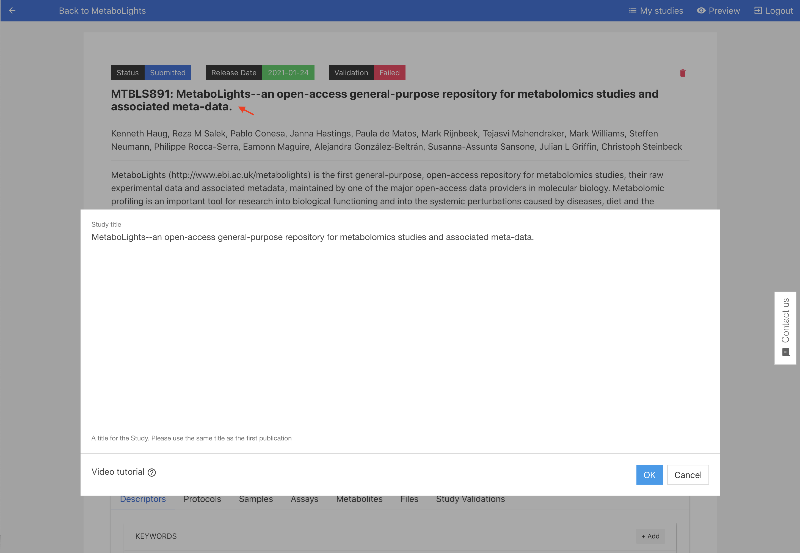
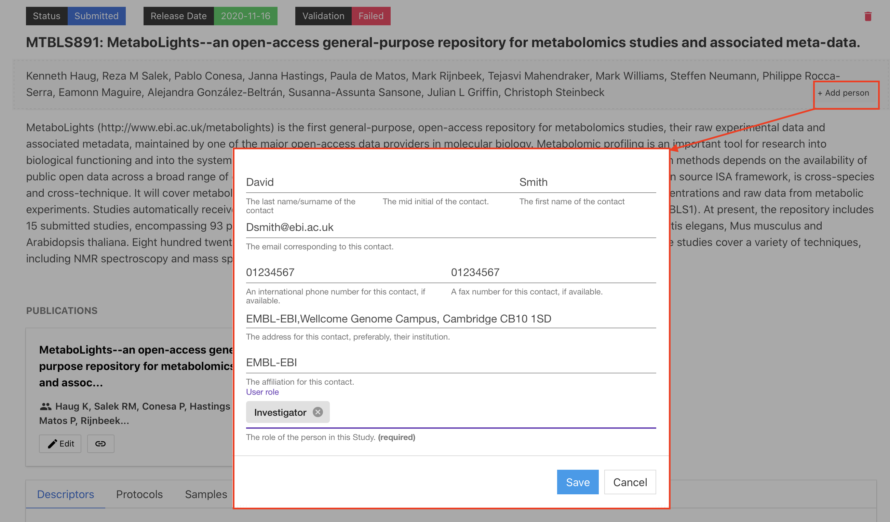
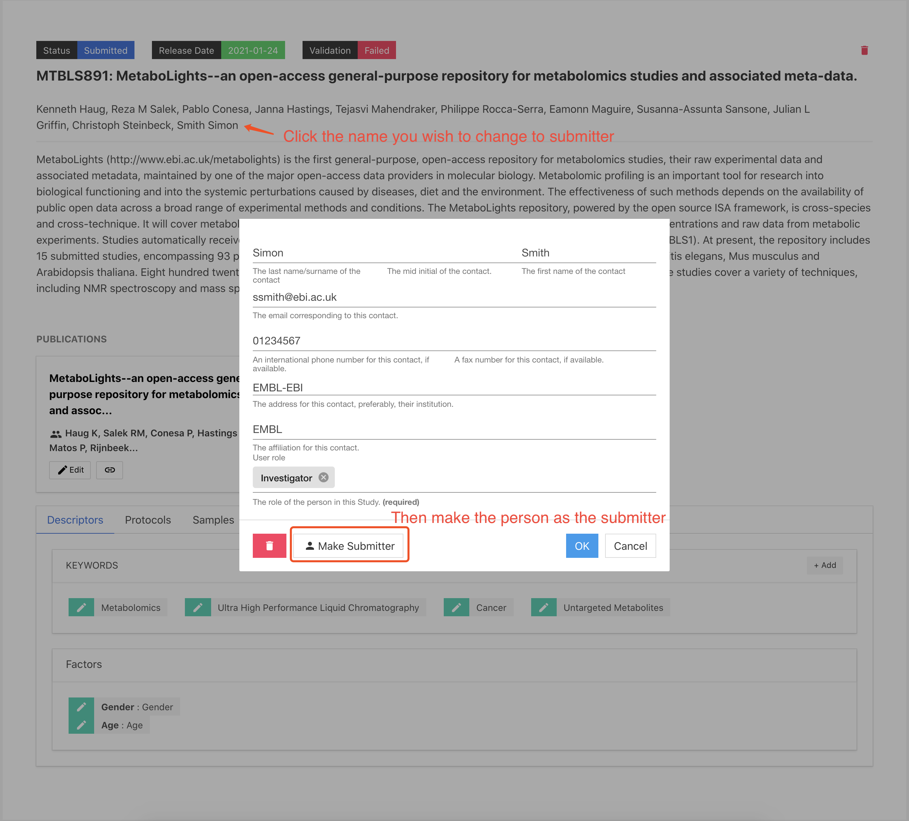
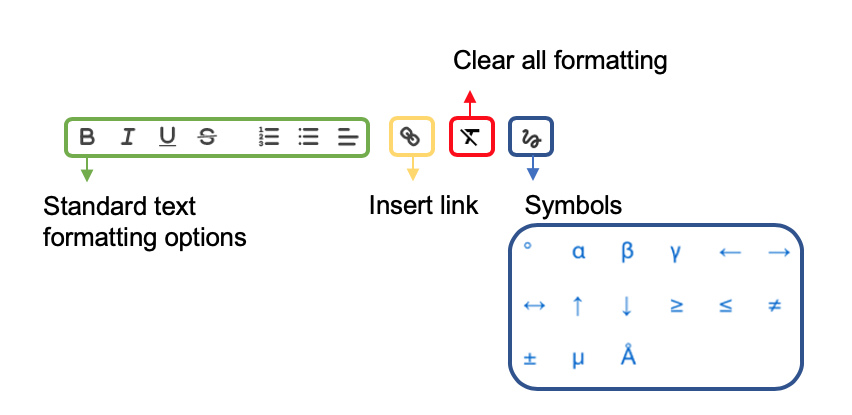
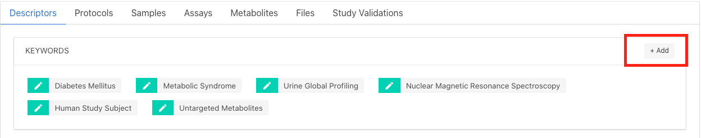

# Study Description

/// tip |  **MetaboLights APIs**
 You can update your study programmatically using our APIs.
 Try the MetaboLights study title API - [**GET**](https://www.ebi.ac.uk/metabolights/ws/api/spec.html#!/spec), [**PUT**](https://www.ebi.ac.uk/metabolights/ws/api/spec.html#!/spec) using our [swagger interface](https://www.ebi.ac.uk/metabolights/ws/api/spec.html#!/spec).

/// 

/// question | More question
 Can't find what you are looking for? Check out our [FAQ's](FAQs.md#maf) for most commonly asked questions and solutions.
///

## Study title
The study title should be clear and concise, ideally the same title as used for the corresponding manuscript.

Submitters can add or modify a study title by selecting the title section and entering in the new title in the dialogue box or by providing the manuscript DOI in the publication section and selecting the **Import title** option.

---

## Authors
Please provide names and details for study authors. This can be done by selecting **+Add person** in the author section or by providing the manuscript DOI in the publication section and selecting the **Import author** option.

{width=600}

### Study access for authors
Submitters are the study creators and editors, they have access and edit rights to the private study during the submission process and correspondence will be directed to the submitter. They will also be the main contact for once the study is public.

Authors are named contributors (as for a manuscript) but will not automatically have edit rights or private access to the study.

The submitter can provide access & edit rights to other authors provided they also have a MetaboLights account. First add as an author (must include email), select name from the author list and then choose **Make Submitter** option.

{width=600}

---

## Abstract
The abstract should give a brief summary of the study as highlighted below. It is recommended to use the same abstract as the publication.

1) The overall purpose of the study
2) The basic design of the study
3) Major findings or trends found as a result of your analysis
4) A brief summary

### Update Abstract from the publication
Your MetaboLights study abstract can be updated to match your publication abstract.

### Formating abstract
Within the abstract editing section, there will be formatting options available as below.

{width=400}

### Validation rules

* The study abstract should be at least 60 characters long.

---

## Publications
The publication information should match any associated manuscript, include title, abstract, authors and publication status.

### Add publication
Please add your publication details by guided submission or study online editor. The study title, abstract and authors also can be imported using a publication DOI, PubMed or EuropePMC identifier.

### publication status
- In preparation: Publication in preparation before submitting to a journal.
- Submitted: Publication submitted to a journal.
- Preprint: publications that have URL/DOI for an online copy that can be viewed by anyone but is not the final version.
- Published: Publication published in a journal.

### Validation rules

* The publication title should be at least 25 characters long.
* Provide a list of authors, separated by commas. As appears in the publication, do not include affiliation.
* Only provide the id number, not prefixed with PMID.
* Provide the publication status, this should be at least 5 characters long.

---

## Keywords
Effective keywords for your study portray an accurate representation of what you publish. It also helps MetaboLights search to indexes the study. Keywords should:
 - Represent the content of your manuscript
 - Be specific to your field or sub-field

### Add keyword
To add new keywords to your study, you can click the +Add in the keywords section. Type the keyword and use the drop-down to select the most relevant ontology term. If the input term can’t match to any of our ontology control vocabulary, type your plain text and press enter to accept (then OK to add to the keyword).

### Are there any limits on the number of keywords?
We have no limit on the number of keywords.

