# Quick Start Guide

## Submission Checklist

/// tip

**Before Submission:**

- [X] Create MetaboLights user [account](MetaboLights_account.md#create-account) (If you do not have one).

- [X] Make ready study supplementary, derived, and raw data. ie. ***spectral files*** produced by the analytical instrument and/or an open source version. Please see  [accepted file formats](Files.md#raw-data).

- [X] MetaboLights **accepts only file names containing letters (a–z, A–Z), numbers (0–9), hyphens (-), underscores (_), or dots (.)**. Please ensure that supplementary, derived, and raw data file names comply with this pattern. Otherwise, rename them accordingly. **Space characters are not accepted.**

- [X] **Starting on 12th June 2025, MetaboLights will accepts only raw/derived data files and compressed versions of raw/derived data folders (e.g. .d, .raw, or any NMR raw data folder)**. If your study includes raw data folders, please compress each folder **individually** using a ZIP utility before submission.  **A zip file containing multiple raw folders is not accepted.**

- [X] Organize your supplementary, raw and derived data files on your local storage. Create subfolders if needed. **Subfolder names MUST comply with filename pattern**. Ensure subfolder names contain only letters (a–z, A–Z), numbers (0–9), hyphens (-), underscores (_), or dots (.)

- [X] If you want to use FTP to upload your data files, install an FTP client (e.g. FileZilla).

- [X] If you are not principal investigator of the study, collect principal investigator contact information (e.g. email, phone number, fax number, affiliation, etc.).

**During Submission:**

- [X] If you are experiencing problems with Aspera, try to use FTP client to upload your data (i.e. Filezilla).
  
- [X] Ensure your data file uploads are completed successfully. 
  
- [X] Do not forget to index your FTP folder after your new uploads.
  
- [X] Complete all fields of the following sections [metadata](index.md#study-overview):
    - Summary: title, abstract/description, contacts
    - Publications
    - Descriptors: Define at least 3 keywords.
    - Protocols 
    - Samples
    - Assays
    - Metabolites

- [X] Add principal investigator as a contact person.
- [X] Define at least one study factor and complete its values (At least two rows MUST be filled with different factor values).
- [X] Ensure sample names are unique and referenced in assay files.
- [X] If you want to bulk update on your local, follow these steps:
  
    - Download metadata file on Files tab.
  
    - Open the metadata file with your favorite editor (Microsoft Excel, OpenOffice, etc) without changing the original format and encoding.
  
    - Update the metadata data file on your favorite editor.
  
    - Save it without changing the original file extension, format and encoding.
  
    - Ensure that the local metadata file name is exactly the same as in your study folder on MetaboLights Editor.
  
    - Upload the metadata file and 'synchronise metadata files' on Files tab on MetaboLights Editor.
  
    - Refresh your editor (if needed) 

- [X] Reference your raw data or derived files in the **'Raw Spectral Data File'** or **'Derived Spectral Data File'** column of your ASSAY files. **Be sure all referenced data files start with FILES/ prefix**. Example: FILES/RAW_FILES/myfiles.raw OR FILES/DERIVED_FILES/myfiles.mzML.
  
- [X] Datasets with ***.wiff*** and ***.wiff.scan*** files require the upload of both types of files. Adding an extra  **'Raw Spectral Data File'** column is required to reference them in the corresponding ASSAY.

- [X] Run study validation and fix all errors.
- [X] Define and update your study release date.

///

## Overview

/// success | Create Study
Select [Submit study](https://www.ebi.ac.uk/metabolights/editor/console) in the MetaboLights homepage to create a new submission (or edit an existing one). 

**Recommended**: *Use ‘Create New Study’ from the editor console and select ‘Guided Submission’ to be guided through the submission creation step by step.*

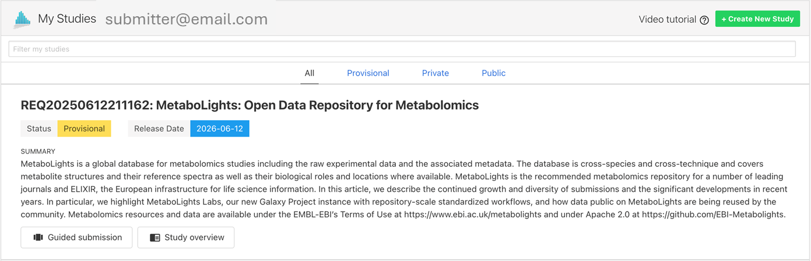

Choose to upload your RAW files at this point or later.

**Note:** *You will be issued a temporary identifier (REQxxx). Please refer to this identifier in any communication with the MetaboLights team.*

///

/// success | Update Study Metadata 

Use the Online Editor option to view and edit existing submissions. Access through *My Studies* page or with a study URL.  

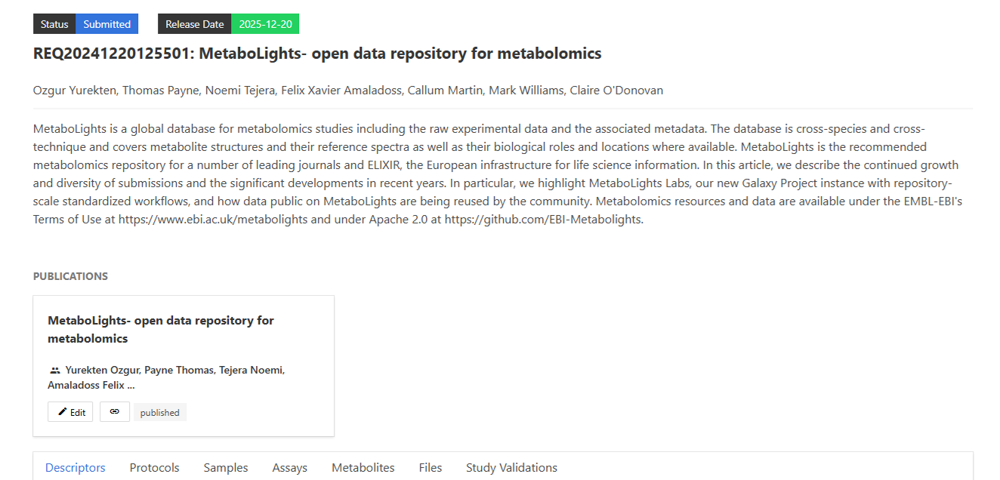

**Note:** *You can give collaborators edit rights to the study following these [steps](Study_description.md/#study-access-for-authors).*

///

/// success | Validate 

Studies must pass validation to be private. Validation errors are evident in the information bar at the top of the study (if nothing is displayed the study has passed validation). Details of errors are available in the study validations tab.

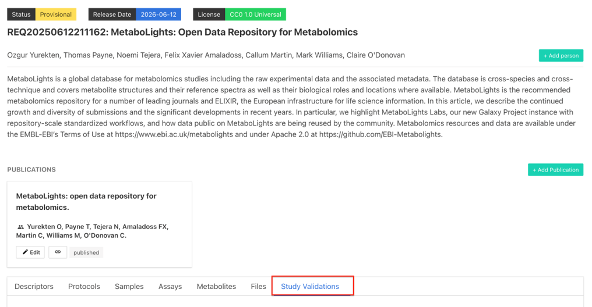

**Validation Framework v2** - With the aim of improving reporting and speeding up data release, the MetaboLights team has developed a more structured and stricter [new study validation ruleset](https://github.com/EBI-Metabolights/mtbls-validation). 

Temporary submission requests (REQxxx) must pass validation to be promoted to ‘Private’ and get assigned a full MetaboLights study accession number (MTBLSxxx). 
Validation errors are evident in the information bar at the top of the study (if no validation box is displayed, next to ‘Release Date’, the study has passed validation). Details of errors are available in the ‘Study Validations’ tab.

///

/// success | Make Your Study 'Private'

To promote your temporary submission request (REQxxx) to ‘Private’ and obtain a full MetaboLights study accession number (MTBLSxxx), select **Status** and change from 'Provisional' to ‘Private’. 

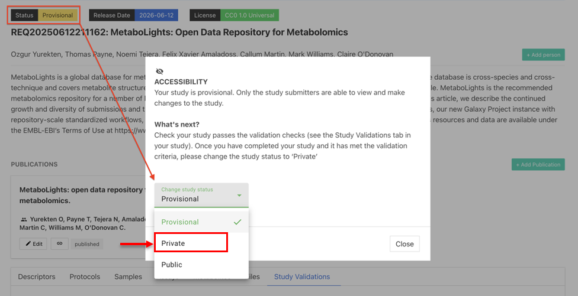

/// warning | Update release date before making your study Private
If your study reaches 'Private' status, you can make it public at any time. 

MetaboLights will automatically release your dataset to the public 1) when the selected release date is reached or 2) upon notification of the corresponding publication. 

If the MetaboLights team selects your study for manual curation, the curation process may extend the selected release date and the study will become public once the curation is complete. 

///

/// note | Update your 'Private' study

'Private’ studies cannot be edited. If amendments are required (e.g. update manuscript DOI number, update release), change your study status to 'Provisional' and update your study. After you complete amendments, validate your study and update study status to 'Private' again.
///

/// note  | What to include in your Manuscript

Please add to your manuscript the following sentence (typically in the "Methods" section or just before/in the Acknowledgements):

"The metabolomics data have been deposited to MetaboLights[1] repository with the study identifier MTBLSxxx".

MetaboLights reference:

[1] Yurekten O, Payne T, Tejera N, Amaladoss FX, Martin C, Williams M, O'Donovan C. MetaboLights: open data repository for metabolomics. Nucleic Acids Res. 2024 Jan 5;52(D1):D640-D646. doi:10.1093/nar/gkad1045. PMID:37971328.

We would recommend you to also include this information in a much abridged form into the abstract itself, e.g. "Data are available via MetaboLights with identifier MTBLSxxx."

///
///

/// success | Obtain Your Reviewer Link

‘Private' studies offer a private read-only 'Reviewer Link' on the study page, which it will make easier to share your validated submissions with collaborators, reviewers, editors, etc.

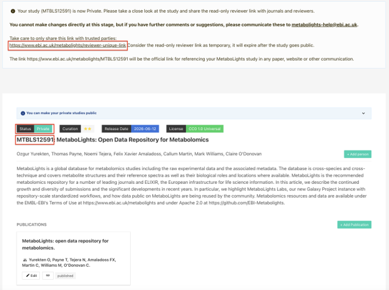

**Note:** MetaboLights curation will be retained in certain cases.

///

/// success | Publish

Make your study public once your manuscript is accepted and no further updates are needed.

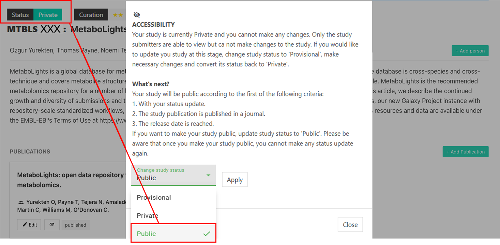

**Note:** *It can take up to 24h for your study to be publicly available.*

Please add to your manuscript the following sentence (typically in the "Methods" section or just before/in the Acknowledgements):

*"The metabolomics data have been deposited to MetaboLights[1] repository with the study identifier MTBLSxxx".*

MetaboLights reference:

[1] Yurekten O, Payne T, Tejera N, Amaladoss FX, Martin C, Williams M, O'Donovan C. MetaboLights: open data repository for metabolomics. Nucleic Acids Res. 2024 Jan 5;52(D1):D640-D646. doi:[10.1093/nar/gkad1045](https://doi.org/10.1093/nar/gkad1045). PMID:37971328.

We would recommend you to also include this information in a much abridged form into the abstract itself, e.g. *"Data are available via MetaboLights with identifier MTBLSxxx."*

**Note:** Please send manuscript DOI to [MetaboLights help](mailto:metabolights-help@ebi.ac.uk) once available.
///

## Submission Process

Overview of the 3 stages in the study submission process.

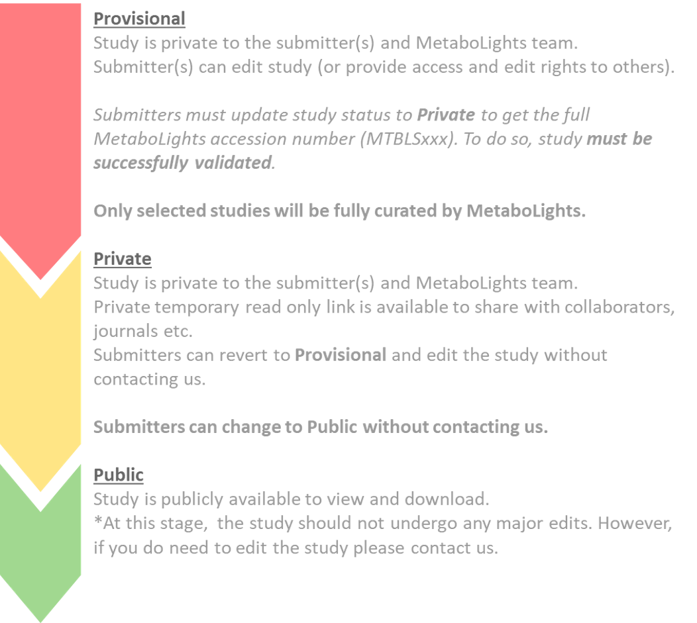{width=500}

### 'In Curation' Studies 

Studies with status **In Curation** in the previous workflow, will now have **Private** status under the **new workflow**.

For those submitters who wish to make their studies ***Public***, please: 

1) Change status to ***Provisional*** (drop down menu in the status bar at the top of your study).
 
3) Run new Study Validations and address errors, until validation is successful.
   
4) Change status to ***Private*** (i.e. keep private until publication is out) or ***Public*** (for immediate release).

## Create Study

Select [Submit study](https://www.ebi.ac.uk/metabolights/editor/console) followed by 'Create New Study' to be taken to the Guided Submission Portal.
If you have an existing account you will first be taken to My Studies where you can choose to edit an existing study (MTBLSxxx) or create a new study (REQxxx).

### Guided Submission Portal

The Guided Submission Portal will take you through the steps to create your MetaboLights submission (study).
A new temporary submission request will be automatically generated with a unique study identifier. 

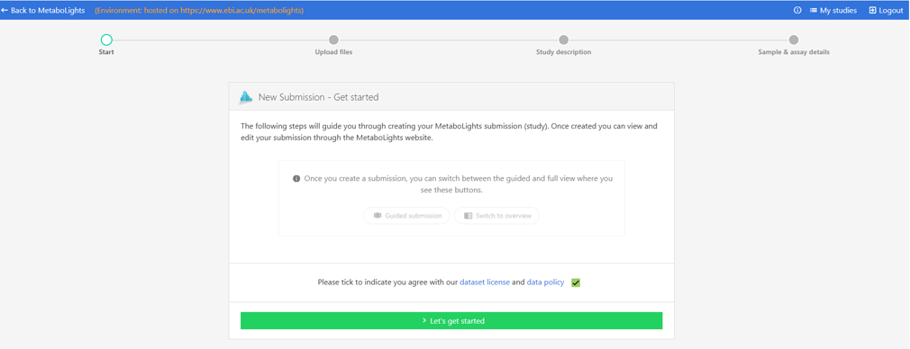

You can exit the guided submission at any time and the information you have added will be automatically saved. To re-enter the study in Guided Submission mode, simply go to My Studies and select the Guided Submission option below the study information.

You can also switch between guided submission and online editor at any point by clicking on the icon on the bottom right of the screen. 

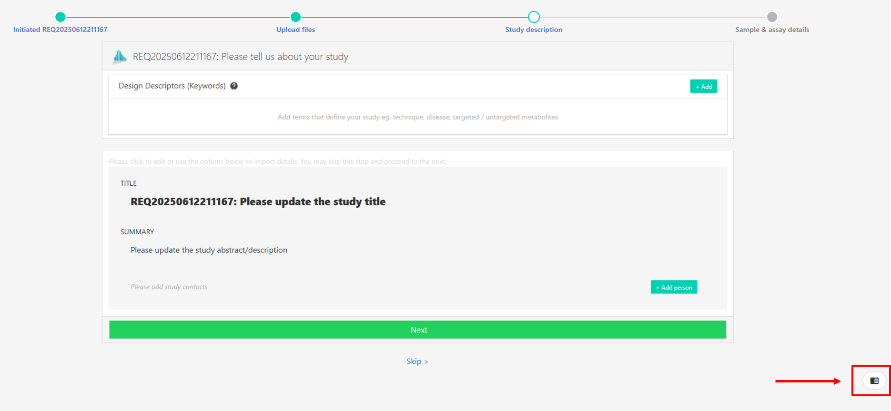

### Submitters and authors

Submitters are the study creators and editors, they have access and edit rights to the private study during the submission process and correspondence will be directed to the submitter. They will also be the main contact for once the study is public.

Study Contacts are named contributors (as for a manuscript) but will not automatically have edit rights or private access to the study.

The submitter can provide access & edit rights to collaborators provided they have a MetaboLights account by adding first as an author and then choosing [Make submitter](Study_description.md#authors).

A Submitter can only create or currently have a maximum of 2 studies in the Submission stage. If you need to create more studies then contact the MetaboLights team through the support email: metabolights-help@ebi.ac.uk.

## Edit Study

 All studies can be edited directly online. To access, choose from the options below.

- Navigate to MetaboLights Editor[Home](https://www.ebi.ac.uk/metabolights/editor/console) and  page and click Study overview.

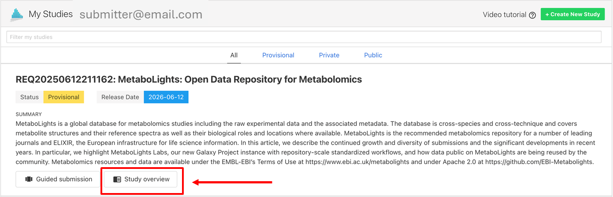

- Use the temporary URL assigned when your study was created. This will be something like (https://www.ebi.ac.uk/metabolights/editor/study/REQxxx). 

When editing a study there is always the option to switch between the **Guided Submission** mode & the **Study Overview** editor. Look for the pop-out option in the bottom right corner of the screen or choose either option on your My studies page.

Studies can be edited **online** or **downloaded and edited in e.g., MS Excel**. 

It is important **not to remove existing columns, change column order or alter column headers** when editing, as the format is a fixed requirement linked to validation. Additional columns can be added, e.g., in the Samples Section by choosing **+factor**, to better describe samples. This should be done online before downloading files.

Some sections of metadata require ontology fields. When adding information using the online options, ontology options will appear as you type. If uploading a file without ontologies added, the Online Editor will prompt you to select ontologies in the fields above the tables.

## Shortcuts & Functions

### Text fields

In text fields such as abstract and protocols, formatting options are available as below. To accept a change select Save and OK to exit.

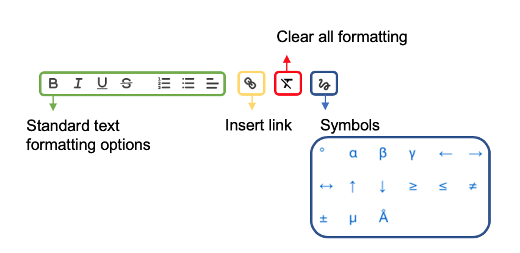{width=500}

### Tables

| Action | Description |
| --- | --- |
| Auto complete column | Click on column header & enter text to add information to the entire column. |
| Copy paste multiple | Select an entire column (click on header) or highlight several cells to paste the same information into each. |
| Paste list | Select an entire column (click on header) to paste a list (starting in first cell) from e.g., Excel |
| Add sample | Select cell and paste / type sample name |
| Add multiple samples | Use +samples to add a list of sample name or import names using the names of raw data files |
| Add row | +row |
| Delete row | Select end of row to highlight, then delete option. 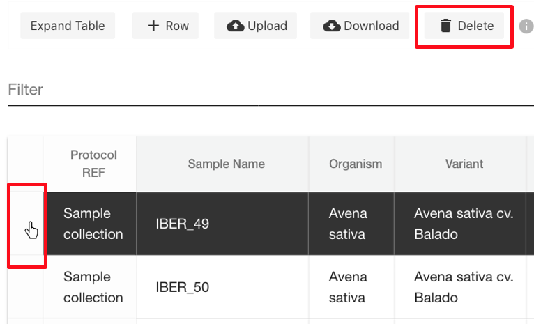{width=500} |
| Add columns | Use +factor option to add more columns to sample sheet |
| Expand table | To view underlying ontology information |
| Upload / download | Up / download files underlying a specific table to edit offline in e.g., text editor or Excel etc (ensure to retain study name & extension) |
| Filter | 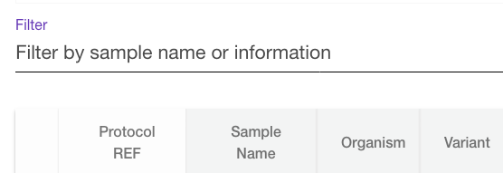{width=400} |

### Ontologies

Where possible terms are supported by controlled vocabularies / ontologies. Simply start to type and if available, options will appear below and you can select the appropriate term. If the term you are looking for does not appear, simply press enter and the text to add it as free text.

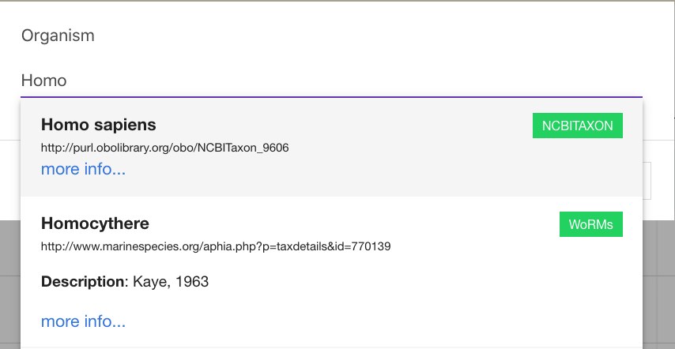{width=500}

Where ontologies have not been added within tables a section will appear above the table to highlight terms. Simply click edit option to add on.

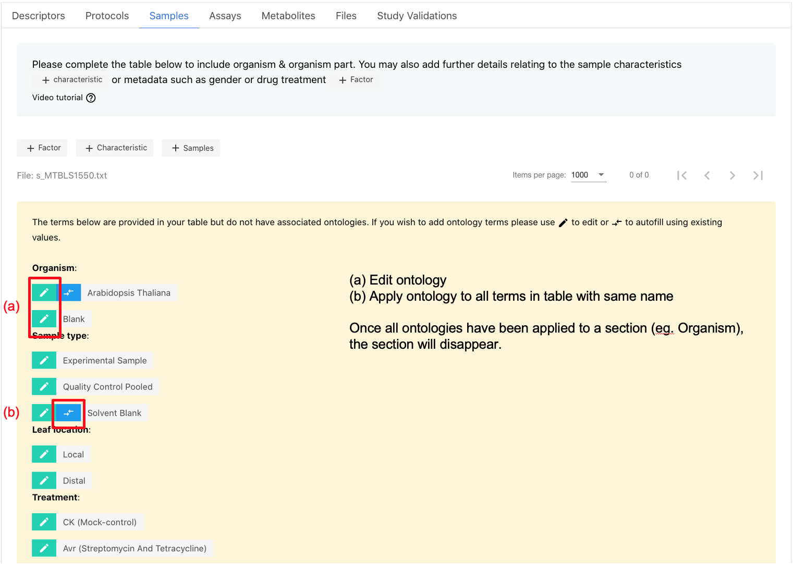

For detailed information on which ontologies are prioritised for each section of your study, please refer to our [GitHub Prioritised-control-lists](https://github.com/EBI-Metabolights/mtbls-validation/blob/main/docs/prioritised-control-lists/sample-file-control-lists/sample-file.md). 

We also encourage users to explore leading ontology repositories such as the Ontology Lookup Service [OLS](https://www.ebi.ac.uk/ols4/) and [BioPortal] (https://bioportal.bioontology.org/). In addition, [ZOOMA](https://www.ebi.ac.uk/spot/zooma/) is a valuable tool for identifying optimal ontology mappings and converting free-text annotations into consistent ontology terms.  

## Study Overview

When you create a study the Guided submission process will take you through the setup step-by-step. It will guide you through raw and sample data upload, creating assays and provide you with controlled vocabulary/ontology options in relevant fields. If you don’t have all the information to hand, don’t worry! You can access and edit your entire study at any time when in submission from your [My Studies](https://www.ebi.ac.uk/metabolights/editor/console) page.

Each MetaboLights study has 4 main sections, study description, sample, assay and metabolite information. The basic outlines for each are given below. Each section also corresponds to a specific file as indicated in which the information is stored.

### Study description (i_Investigation.txt)

This section provides a description of the study, an overview that will inform the reader the type of data they will find.

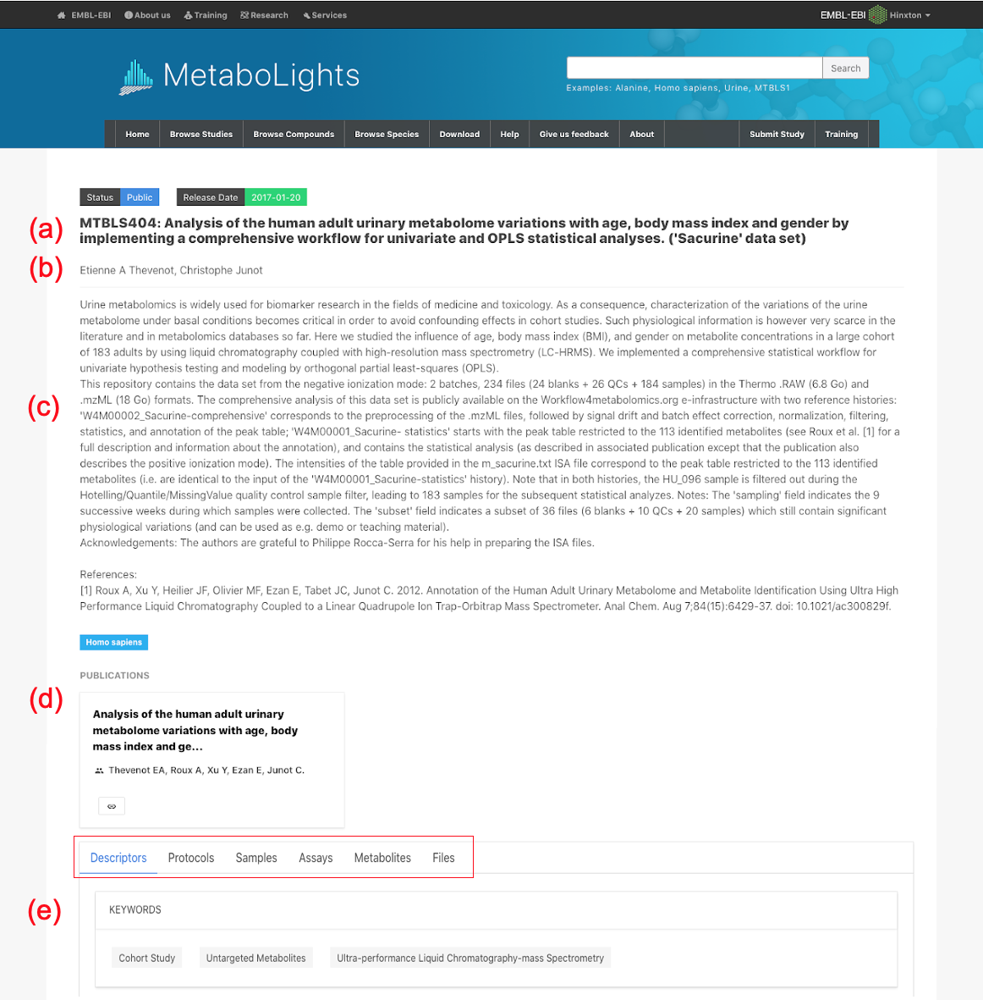
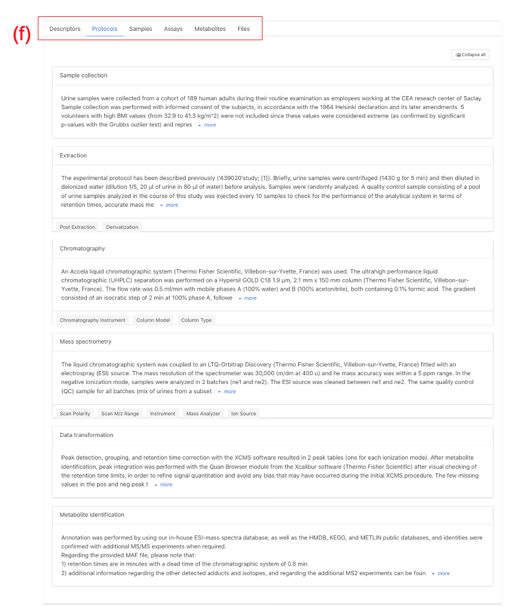
**Note:** *Study identifier & title (b) Contacts (c) Study Description (Abstract) (d) Publication link (e) Design Descriptors (Keywords) (f) Protocol text*

There are several parts to this section:

* `(a) Study identifier & title`: MTBLSxxx identifier provided by MetaboLights and descriptive title which should match manuscript title.
* `(b) Author information`: A list of all contributing authors.
* `(c) Abstract`: High level description of the study.
* `(d) Manuscript publication information:` Manuscript title, authors and public link. A tentative title should be provided if the manuscript is in preparation. This can be updated at any stage by contacting MetaboLights Help directly and a DOI / PMID Identifier can be used to update title/author/abstract directly from the manuscript.
* `(e) Keywords / Descriptors`: e.g., untargeted metabolites, high performance liquid chromatography, oncology
* `(f) Descriptive protocols`: When an assay is selected a set of corresponding protocol boxes will automatically be generated in the protocol section to guide the required information.

### Sample information (s_MTBLSxxx.txt)

The sample information should provide all relevant facts about each sample and any controls / standards included in the study. There is ONE sample sheet per study.
Sample metadata should include a unique sample name, organism, organism part (for controls use e.g., experimental blank and solvent) and sample type (ie. control, QC, experimental sample). Further sample descriptors should be included where available by selecting +Factor to add new columns (e.g., Gender, Age, Treatment).

### Assay information (a_MTBLSxxx.txt)

The assay information will describe the assay process for each control and sample in the assay and connect the sample name to both its corresponding raw data file and metabolite identification table. 

MULTIPLE assays can be added per study.

The assay is divided into sections each starting with a Protocol Ref column, e.g., Chromatography, which describes the specifics of that part of the assay using controlled vocabulary, so every study using the same system is easily findable.

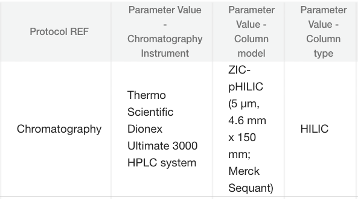{width=400}

### Metabolite information (m_MTBLSxxx.tsv)

Each assay has a corresponding metabolite table. If results are cumulative of multiple assays, use the metabolite assignment file column in the assay table to point all assays to the same m\_MTBLSxxx.tsv file name.

The metabolite information should include all metabolites / unknowns / features identified within the study.

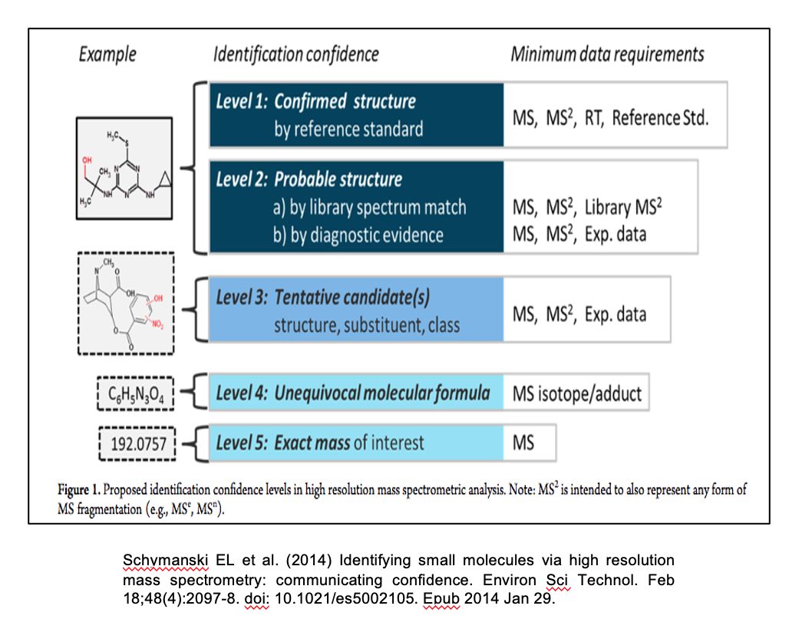{width=600}

## Validate Study

A study must pass validation to progress to the curation stage. Validation errors are evident in the information bar at the top of the study (if nothing is displayed the study has passed validation). Further information can then be found in the **Study Validations** tab.

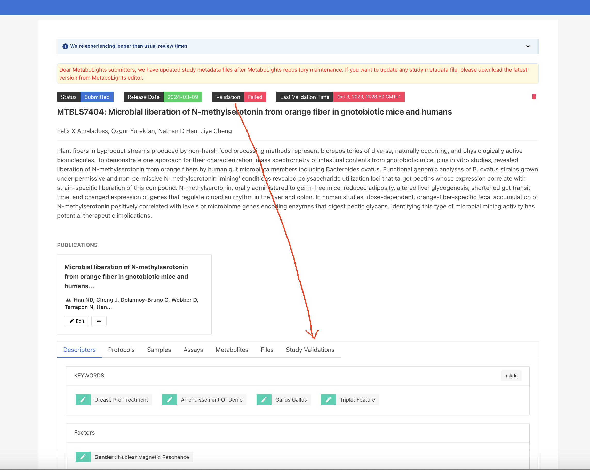{width=600}

For the new studies in the initial stage, it shows status as **Validation Required**. You need to click **Start Validation** button to run the validation job.

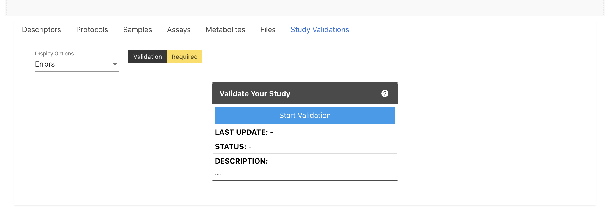{width=600}

 Once the validation process has completed, the status will be updated on top of the Study title and inside the Validation box.

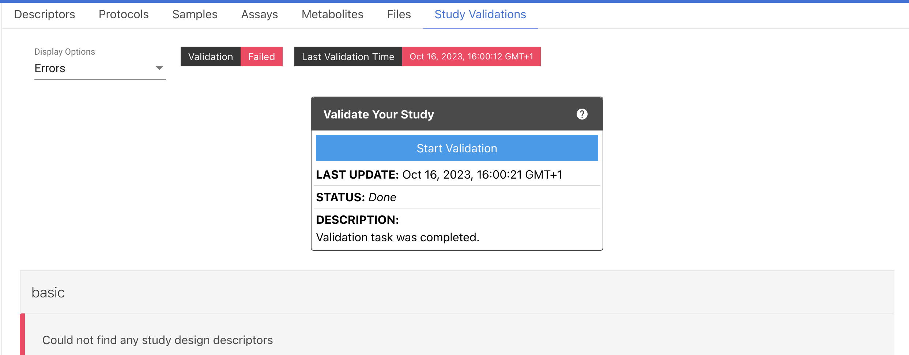{width=600}

The validations report can be downloaded by clicking on the **Download Report** button. The resulting reports generated each time the validations are triggered are available by selecting the **Select a Report** drop-down menu.

Further information is available in the Study Validations tab. There are 7 validation tabs, which include the reported **ERRORS** and **WARNINGS** found in all sections of the study. You must address all errors and should also address warnings where applicable to progress your study.

Study validation will need to be re-run after making any type of edits to the study (e.g. metadata updates and/or data files uploads). If you have any problems or queries, please contact [MetaboLights help](mailto:metabolights-help@ebi.ac.uk).

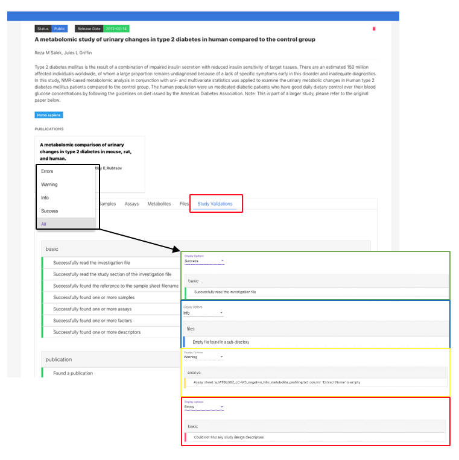{width=600}

## Referencing a study

### What to include in a manuscript

- Permanent unique identifier; MTBLSxxxx.
- Public url for your metabolomics study https://www.ebi.ac.uk/metabolights/MTBLSxxxx.
- You may also wish to cite the MetaboLights reference [Yurekten et al](https://doi.org/10.1093/nar/gkad1045).

### Study accession number

When you first create a new study you will be provided with information about the temporary submission request (e.g., REQxxx) as shown below. You will also receive this information by email. This **REQxxx** is a temporary identifier and **should not** be included in your manuscript.

replace picture 
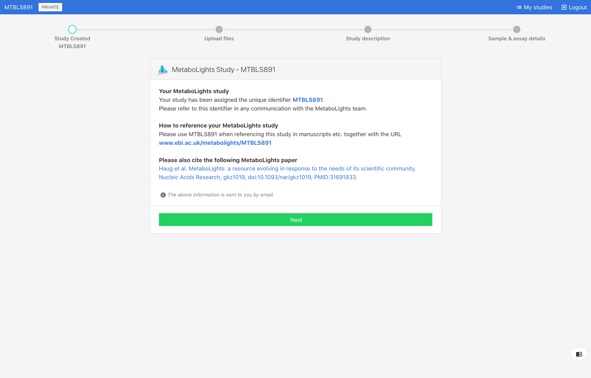

Once the study passes the required validation and status is promoted to ‘Private’, an accession number (e.g., MTBLSxxx) will be issued. This **MTBLSxxx** permanent unique identifier **should be** used to reference the study in manuscripts and other communications. 

As part of MetaboLights new workflow, submitters can change the status of their studies from ‘Private’ to ‘Public’.  You can also use your MetaboLights study URL https://www.ebi.ac.uk/metabolights/MTBLSxxxx to reference your study in any type of publication. 

You can see a list of all your submission requests (REQxxx), studies (MTBLSxxx) & their unique identifiers on your [My Studies](https://www.ebi.ac.uk/metabolights/editor/console) page.

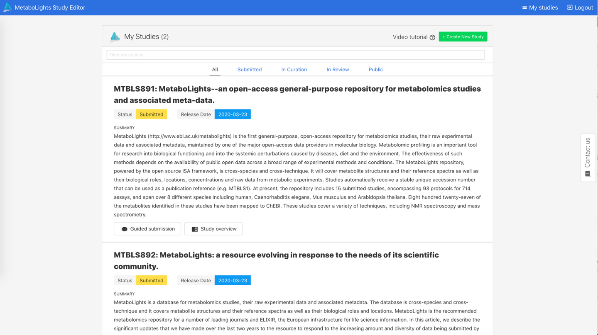

### Reviewer link

Once a study has been completed and the status updated to ‘Private’, a private read-only link will be available at the top of your study page to share with the journal.

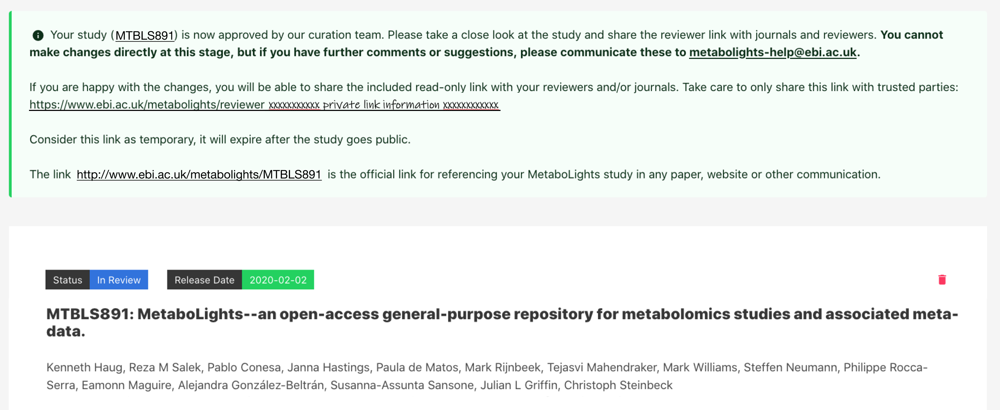
