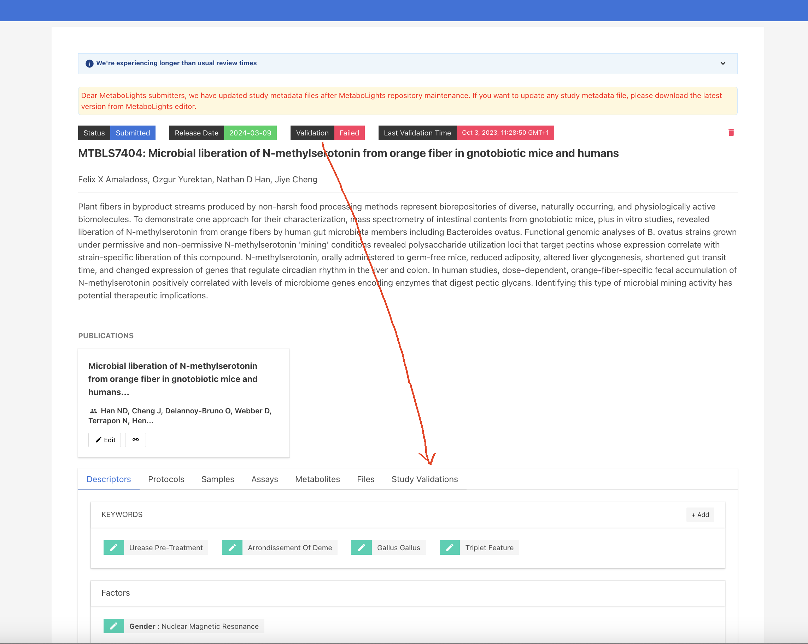
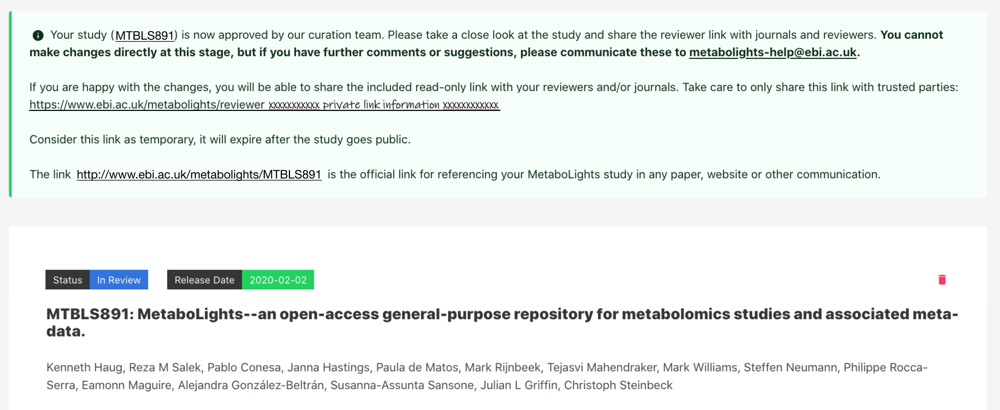
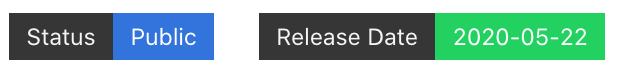
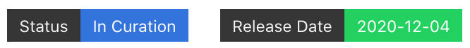
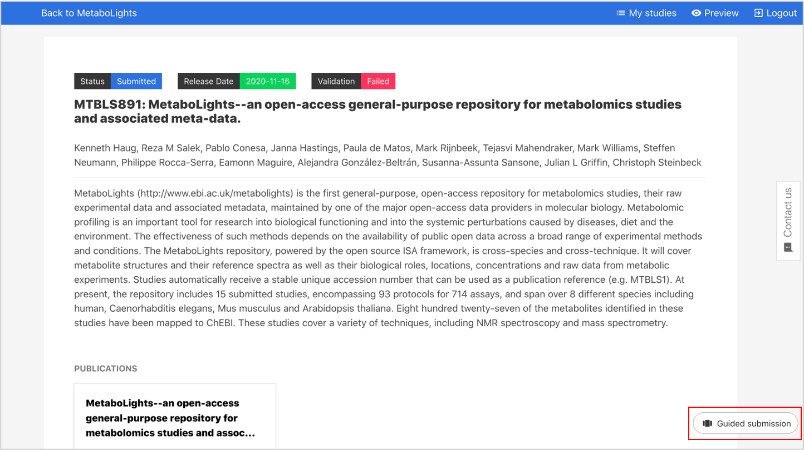
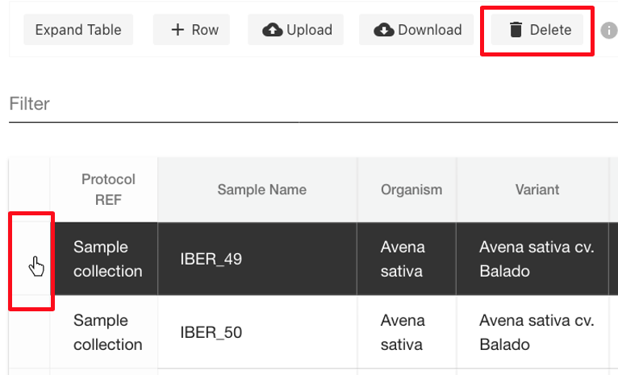
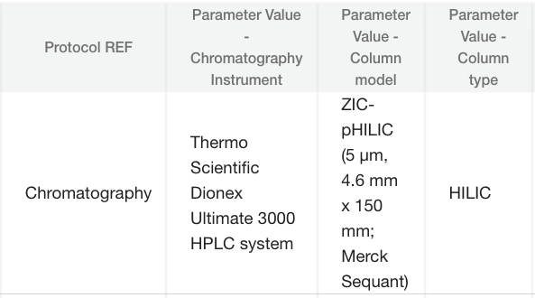
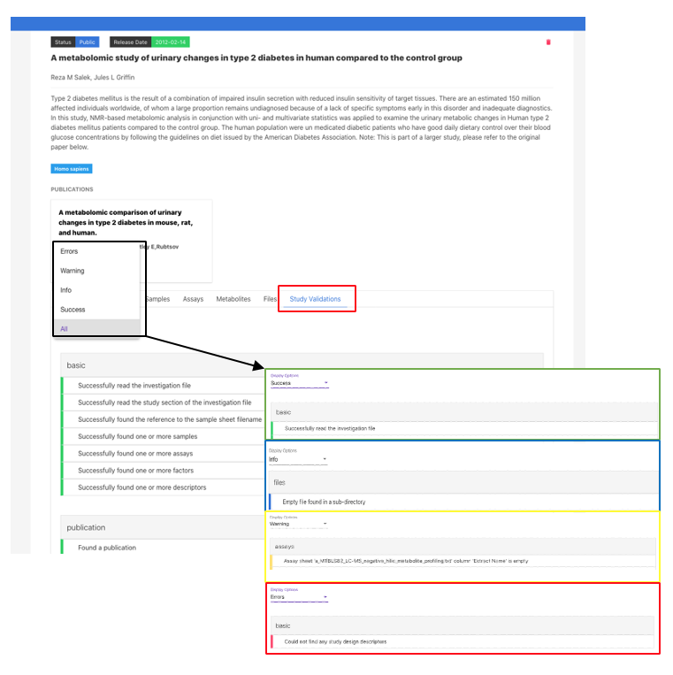

# Quick Start Guide
## Overview

/// success | Checklist 

Before creating a study ensure you have the following;

- MetaboLights [account](MetaboLights_account.md#create-account)

    {width=600 height=400}

- [Raw data](Files.md#raw-data) to submit (or will do by completion of study)
- Supporting study information (ie. sample details, experimental methods, results)

///

/// success | Create 
Select [Submit study](https://www.ebi.ac.uk/metabolights/editor/console) to create a new study (or edit an existing study). 

**Recommended**: *Use Create online to be guided through the study creation step by step.*

**N.B.** *the accession number assigned to your study MTBLSxxx will be the permanent identifier (url www.ebi.ac.uk/metabolights/MTBLSxxx), please use this in manuscripts.*
///

/// success | Edit 

Use the online editor option to view and edit existing studies. Access through My Studies page or with a study url.  

**N.B.**: *You can give collaborators edit rights to the study following these [steps](Study_description.md#authors).*

///

/// success | Validate 

Studies must pass validation to be submitted. Validation errors are evident in the information bar at the top of the study (if nothing is displayed the study has passed validation). Details of errors are available in the study validations tab.

///

/// success | Submit 

To submit study, select **Status** and change to curation (study must validate to do this). You can also set the publication date at this stage. 

**N.B.**  curation process will take a minimum of 4 weeks, publication date cannot be less than this.

Submitted studies cannot be edited, contact MetaboLights help if amendments are required.

///

/// success | Review 

Following successful study curation, the status will be updated to Review. A temporary private link will be available on the study page to share with journal editors, collaborators etc. if requested.

///

/// success | Publish 

A study will be published once the release date is reached. The date can be changed at any stage by contacting us directly.  

{width=300 height=150}

*Please also send manuscript DOI to MetaboLights-help once available.*
///

## Submission Checklist
The primary requirements for study submission to MetaboLights are as follows;

1. MetaboLights user [account](MetaboLights_account.md#create-account).
2. Raw data ie. ***spectral files*** produced by the analytical instrument and/or an open source version. Please see  [accepted file formats](Files.md#raw-data).
3. Complete  [metadata](index.md#study-overview).

## Submission Process
Overview of the 4 stages in the study submission process.

{width=500}

### Submitting a study for curation

Once you have completed the study metadata, uploaded raw data files and the study successfully validates, select the **status** bar at the top of your study and change to **curation**. You will no longer be able to directly edit your study, please contact MetaboLights Help if you need to make further amendments.You will also be prompted to set the public release date for your study, *please note this is automatically set to a minimum of **4 weeks** to allow for the curation process*.

{width=400}

Following successful curation, the status will be updated to **review** and a temporary private *read only* link will be available on your study page to share with journal editors, collaborators etc if requested.

{width=800}

Once the release date is reached the study will become **public**. You can update this date at any stage by contacting MetaboLights Help.

## Create Study
Select [Submit study](https://www.ebi.ac.uk/metabolights/editor/console) followed by **Create online** to be taken to the Guided Submission Portal.

If you have an existing account you will first be taken to My Studies where you can choose to edit an existing study or create a new study.

### Guided Submission Portal

The Guided Submission Portal will take you through the steps to create your study.
A new study will be automatically generated with a unique accession number / study identifier.

You can exit the guided submission at any time and the information you have added will be automatically saved. To re-enter the study in Guided Submission mode, simply go to My Studies and select the Guided Submission option below the study information.

### Submitters and authors
Submitters are the study creators and editors, they have access and edit rights to the private study during the submission process and correspondence will be directed to the submitter. They will also be the main contact for once the study is public.

Authors are named contributors (as for a manuscript) but will not automatically have edit rights or private access to the study.

The submitter can provide access & edit rights to collaborators provided they have a MetaboLights account by adding first as an author and then choosing [Make submitter](Study_description.md#authors).

A Submitter can only create or currently have a maximum of 2 studies in the Submission stage. If you need to create more studies then contact the MetaboLights team through the support email: metabolights-help@ebi.ac.uk.

## Edit Study

 All studies can be edited directly online. To access, choose from the options below.

- Navigate to Editor [Home](https://www.ebi.ac.uk/metabolights/editor/console) and select the appropriate study from your list by clicking Study overview link.

- Use the url assigned when your study was created. Your study URL will be something like (https://www.ebi.ac.uk/metabolights/editor/MTBLSXXX) and then click Edit button right corner. You can also find your study here in the [browse study page](https://www.ebi.ac.uk/metabolights/studies) after logged in

    

- Select your study directly from [My Studies](https://www.ebi.ac.uk/metabolights/editor/console) page using the Study Overview option.

    

When editing a study there is always the option to switch between the Guided Submission mode & the Study Overview editor. Look for the pop-out option in the bottom right corner of the screen or choose either option on your My studies page.

Studies can be edited online or downloaded and edited in eg. Excel. It is important not to remove existing columns or alter column headers when editing as the format is a fixed requirement. Additional columns can be added by choosing +factor, this should be done online before downloading files.

Some sections of metadata require ontology fields. When adding information using the online options, ontology options will appear as you type. If uploading a file without ontologies added, the online editor will prompt you to select ontologies in the fields above the tables.

## Shortcuts & Functions
### Text fields
In text fields such as abstract and protocols, formatting options are available as below. To accept a change select Save and OK to exit.

{width=500}

### Tables

| Action | Description |
| --- | --- |
| Auto complete column | Click on column header & enter text to add information to the entire column. |
| Copy paste multiple | Select an entire column (click on header) or highlight several cells to paste the same information into each. |
| Paste list | Select an entire column (click on header) to paste a list (starting in first cell) from eg. Excel |
| Add sample | Select cell and paste / type sample name |
| Add multiple samples | Use +samples to add a list of sample name or import names using the names of raw data files |
| Add row | +row |
| Delete row | Select end of row to highlight, then delete option. {width=500} |
| Add columns | Use +factor option to add more columns to sample sheet |
| Expand table | To view underlying ontology information |
| Upload / download | Up / download files underlying a specific table to edit offline in eg. text editor or Excel etc (ensure to retain study name & extension) |
| Filter | {width=400} |

### Ontologies
Where possible terms are supported by controlled vocabularies / ontologies. Simply start to type and if available, options will appear below and you can select the appropriate term. If the term you are looking for does not appear, simply press enter and the text to add it as free text.

{width=500}

Where ontologies have not been added within tables a section will appear above the table to highlight terms. Simply click edit option to add on.

## Study Overview
When you create a study the Guided submission process will take you through the setup step-by-step. It will guide you through raw and sample data upload, creating assays and provide you with controlled vocabulary/ontology options in relevant fields. If you don’t have all the information to hand, don’t worry! You can access and edit your entire study at any time when in submission from your My Studies page.Each MetaboLights study has 4 main sections, study description, sample, assay and metabolite information. The basic outlines for each are given below. Each section also corresponds to a specific file as indicated in which the information is stored.

### Study description (i_MTBLSxxx.txt)
This section provides a description of the study, an overview that will inform the reader the type of data they will find.

There are several parts to this section;

* `(a) Study identifier & title`: MTBLSXXX identifier provided by MetaboLights and descriptive title which should match manuscript title.
* `(b) Author information`: A list of all contributing authors.
* `(c) Abstract`: High level description of the study.
* `(d) Manuscript publication information:` Manuscript title, authors and public link. A tentative title should be provided if the manuscript is in preparation. This can be updated at any stage by contacting MetaboLights Help directly and a DOI / PMID Identifier can be used to update title/author/abstract directly from the manuscript.
* `(e) Keywords / Descriptors`: eg. untargeted metabolites, high performance liquid chromatography, oncology
* `(f) Descriptive protocols`: When an assay is selected a set of corresponding protocol boxes will automatically be generated in the protocol section to guide the required information.

### Sample information (s_MTBLSxxx.txt)
The sample information should provide all relevant facts about each sample and any controls / standards included in the study. There is ONE sample sheet per study.
Sample metadata should include a unique sample name, organism, organism part (for controls use eg. experimental blank and solvent) and sample type (ie. control, QC, experimental sample). Further sample descriptors should be included where available by selecting +Factor to add new columns (eg. Gender, Age, Treatment).

### Assay information (a_MTBLSxxx.txt)
The assay information will describe the assay process for each control and sample in the assay and connect the sample name to both its corresponding raw data file and metabolite identification table. 

MULTIPLE assays can be added per study.

The assay is divided into sections each starting with a Protocol Ref column, eg. Chromatography, which describes the specifics of that part of the assay using controlled vocabulary, so every study using the same system is easily findable.

{width=400}

### Metabolite information (m_MTBLSxxx.tsv)
Each assay has a corresponding metabolite table. If results are cumulative of multiple assays, use the metabolite assignment file column in the assay table to point all assays to the same m\_MTBLSxxx.tsv file name.

The metabolite information should include all metabolites / unknowns / features identified within the study.

{width=600}

## Validate Study

A study must pass validation to progress to the curation stage. Validation errors are evident in the information bar at the top of the study (if nothing is displayed the study has passed validation). Further information can then be found in the **Study Validations** tab.

{width=600}

For the new studies in the initial stage, it shows status as **Validation Required**. You need to click **Start Validation** button to run the validation job.

{width=600}

 Once the validation process has completed, the status will be updated on the top of the tab as well as inside the box.

{width=600}

Further information is available in the **Study Validations** tab. There are 4 validation flags which can be viewed individually by selecting the drop-down menu. This includes `successful`, `information`, `warning`, `error`. You must address all errors and should also address warnings where applicable to progress your study.

{width=600}

## Referencing a study

### What to include in a manuscript

- Permanent unique identifier; MTBLSxxxx.
- Public url for your metabolomics study https://www.ebi.ac.uk/metabolights/MTBLSxxxx.
- You may also wish to cite the MetaboLights reference [Yurekten et al](https://doi.org/10.1093/nar/gkad1045).

### Study accession number

Each new MetaboLights study is automatically assigned an accession number eg. MTBLS1. This is a permanent unique identifier and should be used to reference the study in manuscripts and other communications.

When you first create a new study you will be provided with information about the study unique identifier as shown below. You will also receive this information by email.

You can also see a list of all your studies & their unique identifiers on your [My Studies](https://www.ebi.ac.uk/metabolights/editor/console) page.

### Private reviewer link
Once a study has been completed & the status updated to review, a private read-only link will be available at the top of your study page to share with the journal.

